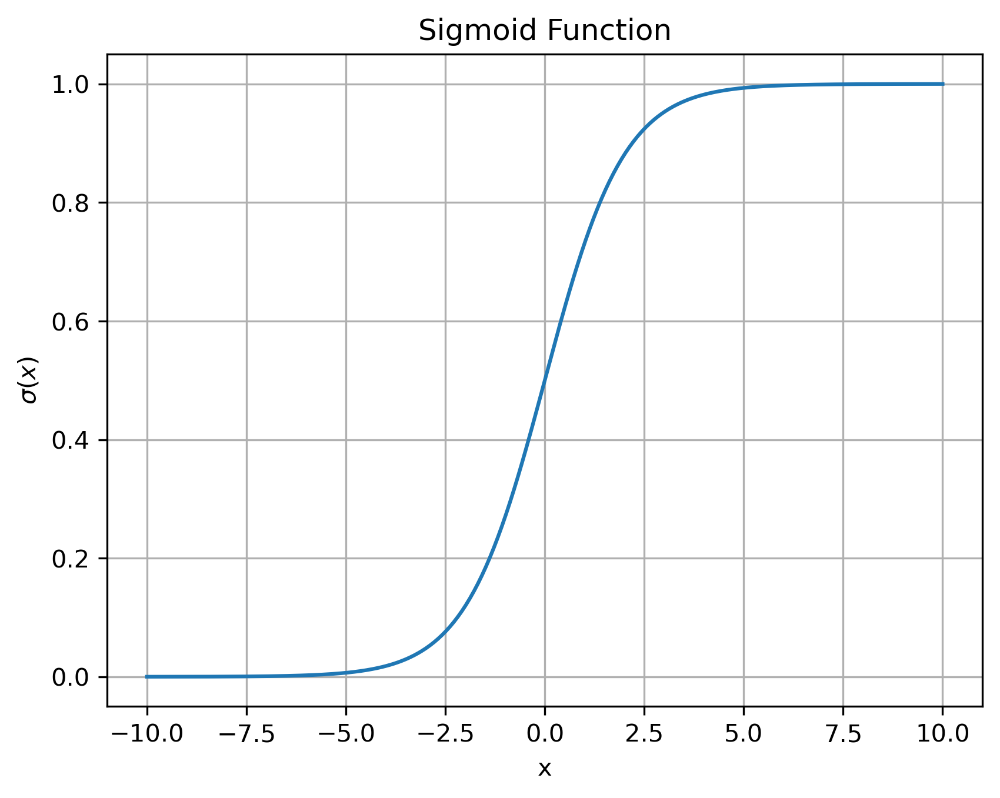
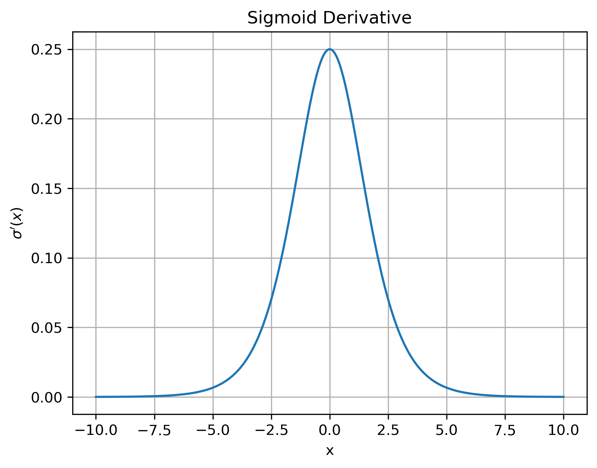
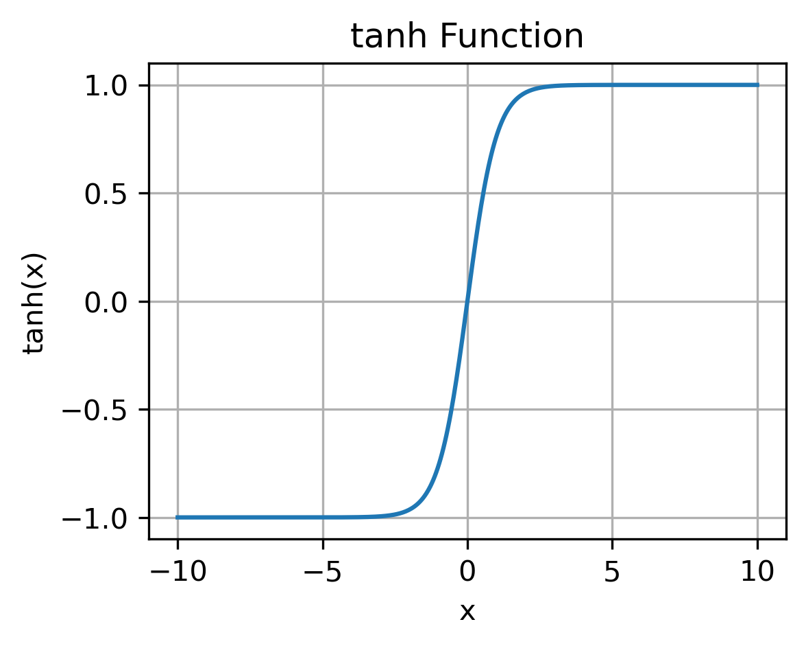
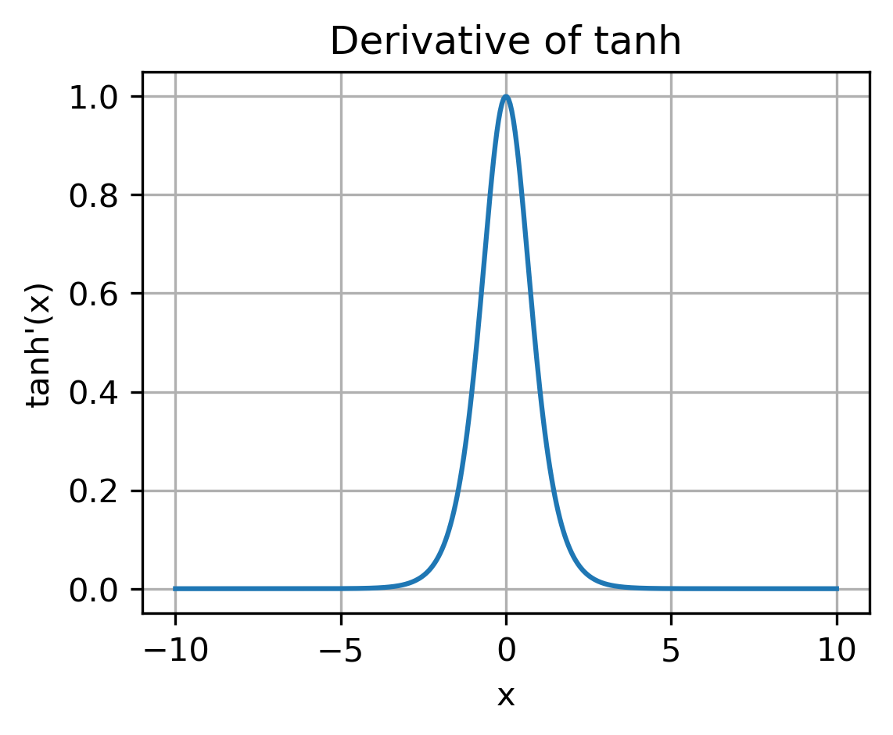
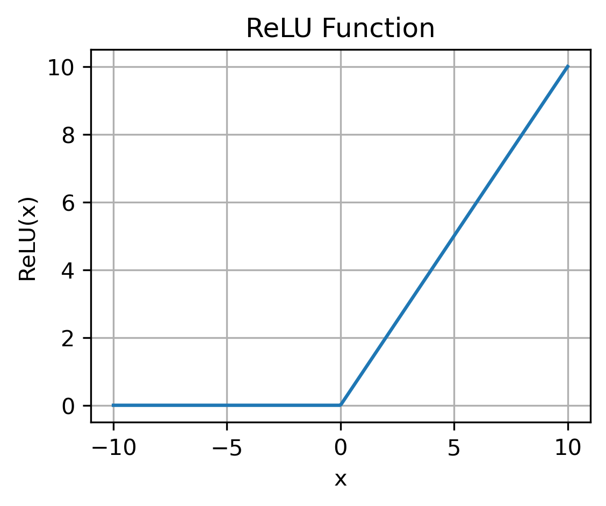
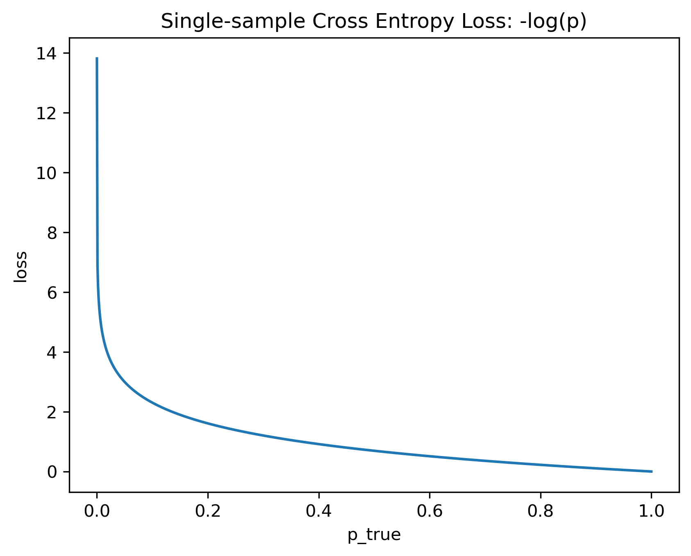
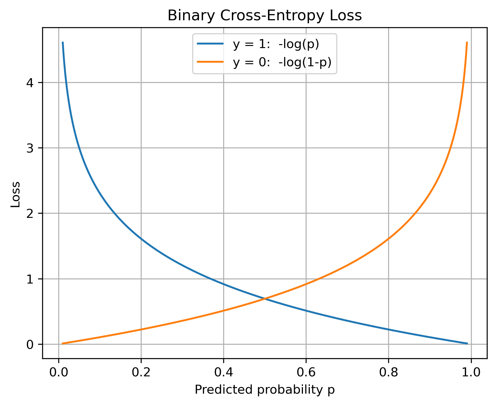
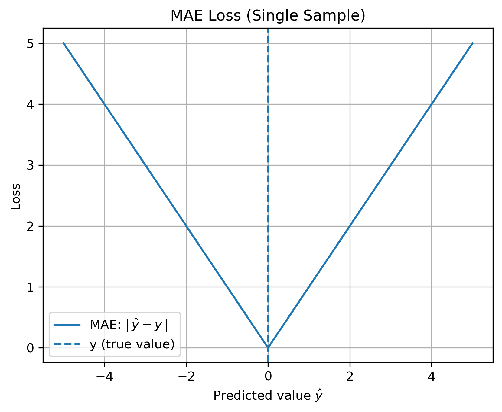
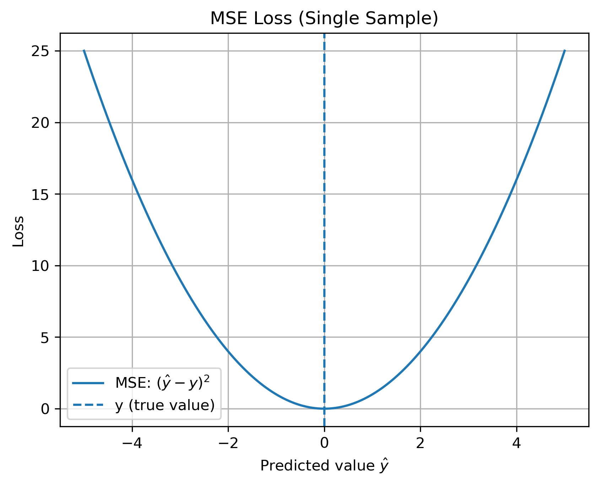
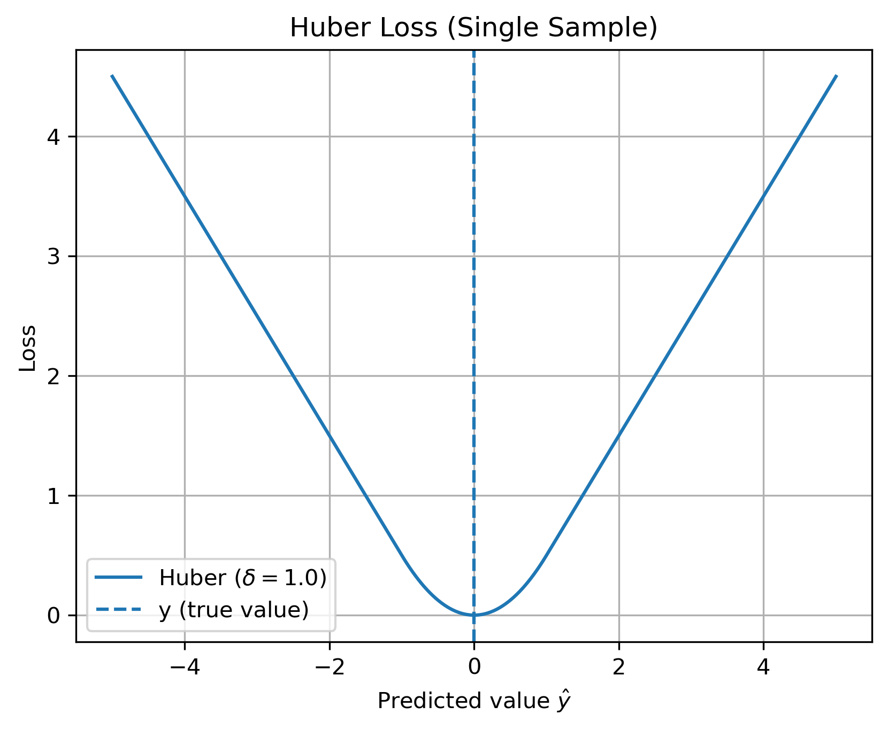

# 一、张量创建
### 1. 张量的基本创建
-
    ```python
    import torch
    torch.tensor 根据指定数据创建张量
    torch.Tensor 根据形状创建
    torch.IntTensor | torch.FloatTensor 创建指定类型
    ```
# 二、张量的运算
### 1. 
### 2. 运算函数
- 平方根
    ```python
    print(data.sqrt())
    ```
- 指数
    ```python
    print(data.exp())
    ```
- 对数
    ```python
    print(data.log())
    print(data.log2())
    print(data.log10())
    ```


# 深度学习vs机器学习
- 
    | 维度 | 机器学习（Machine Learning, ML） | 深度学习（Deep Learning, DL） |
    |----|----|----|
    | 核心思想 | 人工设计特征，模型学习权重 | 多层神经网络自动学习特征表示 |
    | 特征工程（Feature Engineering） | 非常重要，依赖人工经验 | 基本不需要，模型端到端学习 |
    | 模型结构 | 结构简单、浅层 | 结构复杂、多层（Deep） |
    | 常见模型 | Linear / Logistic Regression, SVM, Decision Tree, Random Forest, XGBoost | DNN, CNN, RNN, LSTM, Transformer |
    | 输入数据类型 | 结构化表格数据为主 | 非结构化数据（文本、图像、语音）更有优势 |
    | 数据规模要求 | 小到中等数据即可 | 通常需要大规模数据 |
    | 参数规模 | 参数较少（百到万级） | 参数量大（百万到百亿级） |
    | 训练成本 | 低，CPU 即可 | 高，通常需要 GPU / TPU |
    | 训练速度 | 快 | 慢 |
    | 可解释性（Explainability） | 强，易解释 | 弱，偏黑盒 |
    | 过拟合风险 | 相对较低 | 小数据下易过拟合 |
    | 调参难度 | 相对简单 | 较复杂（结构 + 超参数） |
    | 工程部署 | 简单，成本低 | 复杂，依赖算力与框架 |
    | 应用场景 | 风控、定价、推荐、商业分析 | NLP、CV、语音识别、生成模型 |
    | 金融风控适用性 | ⭐⭐⭐⭐⭐（主流） | ⭐⭐（受限于可解释性） |
    | 是否属于包含关系 | —— | 深度学习是机器学习的子集 |

- ### 为什么金融 / 风控偏向机器学习

一句话：因为要“可解释、稳定、合规”，而不是追求极限精度。

1️⃣ 监管要求

必须解释：为什么拒贷 / 风险高

ML（LR、XGBoost）能解释

DL 难解释 → 不敢用

2️⃣ 数据类型

金融数据 = 结构化表格

ML 天然适合表格

DL 优势在图像 / 文本，不在表格

3️⃣ 数据规模

风控坏样本少、数据不大

DL 容易过拟合

ML 在小样本下更稳

4️⃣ 稳定性优先

风控要稳定 > 微小精度提升

ML 行为可控

DL 波动大、对分布敏感

5️⃣ 成本与工程

ML：CPU、低延迟、易上线

DL：算力贵、部署复杂

一句话面试答案（压缩版）

金融风控更偏向机器学习，是因为需要强可解释性和稳定性，且数据以结构化表格为主，在中小样本场景下，传统机器学习模型比深度学习更易合规和落地。

# 激活函数
### 1. 激活函数作用
- 给“加权求和的结果”加一个非线性规则，让神经网络不再只是线性模型

### 2. Sigmoid

$$
\sigma(x) = \frac{1}{1 + e^{-x}}
$$

&nbsp;&nbsp;&nbsp;&nbsp;&nbsp;&nbsp;&nbsp;&nbsp;&nbsp;

- 定义域：\((-\infty, +\infty)\)
- 值域：\((0, 1)\)
- 单调递增
- 输入值需要在\((-3, 3)\)之间，输出值才会有明显差异，否则结果都接近0或1
---
* **Sigmoid导数为:**
$$
\sigma'(x) = \sigma(x)\bigl(1 - \sigma(x)\bigr)
$$ 

&nbsp;&nbsp;&nbsp;&nbsp;&nbsp;&nbsp;&nbsp;&nbsp;&nbsp;


- 当 \(x = 0\) 时，\(\sigma'(x)_{\max} = 0.25\)
- 值域: \((0, 0.25)\)
- 当 \(|x|\) 较大时，导数接近 0，深层网络中梯度难以反向传播
- 因此，Sigmoid一般只用于二分类的输出层。
>- **为什么Sigmoid不适合做隐藏层的激活函数:**
    **1. 梯度消失现象**
    导数最大值只有0.25，根据链式法则对梯度求导来解权重：
    \[
    \frac{\partial \mathcal L}{\partial \omega_1}
    =
    \frac{\partial \mathcal L}{\partial a_2}
    \cdot
    \frac{\partial a_2}{\partial z_2}
    \cdot
    \frac{\partial z_2}{\partial a_1}
    \cdot
    \frac{\partial a_1}{\partial z_1}
    \cdot
    \frac{\partial z_1}{\partial \omega_1}
    \]
    \(z\) 是线性变化（加权求和）; \(a\) 是激活函数;
    \(\dfrac{\partial a}{\partial z}\) 为 Sigmoid 的导数，取最大值也仅为 0.25。
    多层传递后，梯度 \(\dfrac{\partial \mathcal L}{\partial \omega_1}\) 趋近于 0，造成梯度消失。
    **2. 饱和区间太大**
    若 \(|x|\) > 6，输出值对输入值的变化不敏感，输出值始终为1或者0，被称为饱和区间。
    **神经元饱和:** 饱和区间内Sigmoid的导数趋近于0，导致反向传播链式求导里权重无法更新，神经元进入饱和状态。
    **3. 非0中心问题**
    Sigmoid值域为(0,1)，而不是以0为中心的对称性。根据链式传导公式，a的求导项会对梯度产生影响，导致权重更新方向始终正偏。容易出现 zig-zag 更新，收敛速度变慢。

### 3. Tanh

$$
\tanh(x) = \frac{e^x - e^{-x}}{e^x + e^{-x}}
$$

&nbsp;&nbsp;&nbsp;&nbsp;&nbsp;&nbsp;&nbsp;&nbsp;&nbsp;

- 定义域：\((-\infty, +\infty)\)
- 值域：\((-1, 1)\)
- 单调递增
- 输入值在 \((-3, 3)\) 之间变化最明显，超过该区间后输出逐渐饱和

---
* **Tanh导数为：**
$$
\tanh'(x) = 1 - \tanh^2(x)
$$

&nbsp;&nbsp;&nbsp;&nbsp;&nbsp;&nbsp;&nbsp;&nbsp;&nbsp;

- 当 \(x = 0\) 时，\(\tanh'(x)_{\max} = 1\)
- 值域：\((0, 1]\)
- 当 \(|x|\) 较大时，导数接近 0，仍然存在梯度消失问题。因此只适用于浅层神经网络（5层以下）
- 由于 Tanh 以 0 为中心，相比 Sigmoid，作为隐藏层激活函数更容易收敛


### 4. ReLU

$$
\mathrm{ReLU}(x) = \max(0, x)
$$

&nbsp;&nbsp;&nbsp;&nbsp;&nbsp;&nbsp;&nbsp;&nbsp;&nbsp;

- 定义域：\((-\infty, +\infty)\)
- 值域：\([0, +\infty)\)
- 分段函数，非严格单调递增（在 \(x<0\) 区间恒为 0）
- 当 \(x>0\) 时，输出与输入成线性关系


---
* **ReLU 导数(梯度)为：**
$$
\mathrm{ReLU}'(x) =
\begin{cases}
0, & x < 0 \\
1, & x > 0
\end{cases}
$$


&nbsp;&nbsp;&nbsp;&nbsp;&nbsp;&nbsp;&nbsp;&nbsp;&nbsp;

- 当 \(x > 0\) 时，梯度为 1，不会发生梯度消失
- 当 \(x < 0\) 时，梯度为 0
- 在 \(x = 0\) 处不可导（实际实现中通常取 0 或 1）

>- **为什么 ReLU 适合做隐藏层的激活函数：**
    **1. 计算简单、效率高**  
    ReLU 只涉及比较与取值操作，计算成本低，训练速度快。
    **2. 缓解梯度消失问题**  
    在正区间内，ReLU 的导数恒为 1，反向传播过程中梯度不会因链式相乘而迅速衰减，更适合深层网络训练。
    **3. 稀疏激活特性**  
    当 \(x < 0\) 时输出为 0，使得部分神经元不激活，有助于提高模型的表达效率。 
    **4. 潜在问题（Dying ReLU）**  
    随着训练推进，部门输入会落在 \(x < 0\) 区间，梯度始终为 0，参数无法更新，该现象又叫**神经元死亡**。


>- **什么时候 ReLU 神经元容易“死亡”（Dying ReLU）：**
    1. **偏置 \(b\) 过负**  
    若 
    \[
    b \ll 0
    \Rightarrow z=w^\top x + b < 0\ \text{(对多数 }x\text{)}
    \] 则 \(\mathrm{ReLU}'(z)=0\)，梯度为 0，神经元容易长期卡在负半区。
    2. **学习率 \(\eta\) 过大导致一次更新“跳到负半区”**  
   参数更新：
   \[
   \omega \leftarrow \omega-\eta\frac{\partial \mathcal L}{\partial \omega},\qquad
   b \leftarrow b-\eta\frac{\partial L}{\partial b}
   \] 当 \(\eta\) 很大时，\(\omega,b\) 可能被一次更新推到使
   \[
   \omega^\top x + b < 0
   \] 对多数样本成立，从而后续 \(\mathrm{ReLU}'(z)=0\) 导致无法“拉回”。
    3. **输入分布偏移（数据整体偏负）或初始化不当**  
    若训练初期对多数样本满足
    \[
    \omega^\top x + b < 0
    \] 则该神经元从一开始就几乎不激活，梯度长期为 0。


 ### 5. Softmax

$$
\mathrm{Softmax}(z_i) = \frac{e^{z_i}}{\sum_{j=1}^{K} e^{z_j}}
$$


- 输入为一个向量 \(z = (z_1, z_2, \dots, z_K)\)
- 输出为一个概率分布
- 各分量取值范围为 \((0, 1)\)
- 所有输出之和为 1：
\[
\sum_{i=1}^{K} \mathrm{Softmax}(z_i) = 1
\]

---

>- **为什么 Softmax 通常用于输出层：**
    **1. 概率解释明确**  
    输出值在 \((0,1)\)，且总和为 1，可直接表示类别概率。
    **2. 适合多分类问题**  
    常与交叉熵损失函数（Cross Entropy）联合使用。
    **3. 不适合作为隐藏层激活函数**  
    Softmax 输出存在类别间竞争关系，梯度相互影响，不利于中间特征表示学习。

# 参数初始化
### 1. 初始化的作用:
- **防止梯度消失或爆炸**
权重太大,\( z = \omega x + b \) 很容易变得很大,Sigmoid / Tanh 直接进饱和区,梯度消失
- **提高收敛速度**
合适的起点让梯度能正常传播、模型能学得动、学得快
- **突破对称性**
如果所有参数初始化成一样的值，每个神经元学到的东西一模一样。

### 2. 参数初始化方法
- **全0/全1/固定值初始化**
    ```python
    import torch
    import torch.nn as nn
    nn.init.zeros_()
    nn.init.ones_()
    nn.init.constant_()
    ```
- **均匀分布初始化**   \( \omega \sim U(-a, a) \)
    ```python
    nn.init.uniform_()
    ```
- **正态分布初始化** \( \omega \sim \mathcal{N}(0, \sigma^2) \)
    ```python
    nn.init.normal_()
    ```
- **He Kaiming正态分布初始化**
$$
\omega \sim \mathcal{N}\left(0,\ \frac{2}{fan_{in}}\right)
$$
    ```python
    nn.init.kaiming_normal_()
    ```
    - $fan_{in}$ 表示该层每个神经元的输入连接数。也就是某一层中，单个神经元在前向计算时接收到的输入数量。
    - 全连接层（Linear）：
    $fan_{in} =$ 输入特征数（in\_features）
    - 卷积层（Conv2d）：
    $fan_{in} =$ 输入通道数 × 卷积核高 × 卷积核宽
<br>
- **He Kaiming均匀分布初始化**
$$
\omega \sim \mathcal{U}\left(
-\sqrt{\frac{6}{fan_{in}}},
+\sqrt{\frac{6}{fan_{in}}}
\right)
$$
    ```python
    nn.init.kaiming_uniform_()
    ```
---
>  **为什么 Kaiming 是针对 ReLU 特化:**
>- ReLU 是非对称性的，大约一半的输入会被置为 0，平均来看只有一半神经元在“工作”
> - 线性变化后的 \(z\) 经过 ReLU 后，一半的值变为 0，输出方差约变为原来的一半
> - 若每一层都损失一半方差，信号和梯度会逐层衰减
> - Kaiming 初始化通过控制权重方差补偿，使激活输出的方差保持在合理尺度

>  **方差有什么用:**
>- 经过线性z和激活a后的输出方差：这一层激活输出的离散程度。
>- 方差决定了信号的强弱，是信息量的尺度
>- 方差小：所有神经元的输出都差不多；方差大：数值极端，不稳定。
> - 如果方差小，前向信号衰减，那么反向梯度也会衰减

> **Kaiming初始化的分布区间怎么得出的:**
**底层思想是要求激活方差保持稳定：\(\mathrm{Var}(a)\approx \mathrm{Var}(x)\)**
\[
    \mathrm{Var}(a) \approx \frac{1}{2}\mathrm{Var}(z)
= \frac{1}{2}\left({fan_{in}}\mathrm{Var}(\omega)\mathrm{Var}(x)\right)
\]
因此，为补偿 ReLU 引起的方差减半，权重的方差应设为 $\frac{2}{n_{\text{in}}}$
**在正态初始化中：**
\[
\omega \sim \mathcal{N}(0,\sigma^2)
\]\[
\sigma^2=\frac{2}{fan_{in}}
\Rightarrow
\sigma=\sqrt{\frac{2}{fan_{in}}}
\]
**在均匀分布中：**
均匀分布的方差公式为
\[
\mathrm{Var}(\omega)=\frac{(b-a)^2}{12}=\frac{2}{fan_{in}}\]\[a=\sqrt{\frac{6}{fan_{in}}}
\]
- **Xavier正态分布初始化**
$$
\omega \sim \mathcal{N}\left(
0,\ \frac{2}{fan_{in}+fan_{out}}
\right)
$$
    ```python
    nn.init.xavier_normal_()
    ```
    - $fan_{in}$ 表示该层每个神经元的输入连接数。也就是某一层中，单个神经元在前向计算时接收到的输入数量。
    - $fan_{out}$ 表示该层每个神经元的输出连接数。也就是某一层中，单个神经元在前向计算时输出到下一层的连接数量。

    - 全连接层（Linear）：
    $fan_{in/out} =$ 输入/出特征数  

    - 卷积层（Conv2d）：
    $fan_{in/out} =$ 输入/出通道数 × 卷积核高 × 卷积核宽  
<br>
- **Xavier 均匀分布初始化**
$$
\omega \sim \mathcal{U}\left(
-\sqrt{\frac{6}{fan_{in}+fan_{out}}},
+\sqrt{\frac{6}{fan_{in}+fan_{out}}}
\right)
$$
    ```python
    nn.init.xavier_uniform_()
    ```
# 损失函数
### 1. 多分类交叉熵损失
- 全样本损失求平均的公式
    $$
        \mathcal{L}
        =
        -\frac{1}{N}
        \sum_{n=1}^{N}
        \sum_{i=1}^{C}
        y_{n,i}\,\log(p_{n,i})
    $$
    - $\mathcal{L}$ 表示多分类问题全样本平均值损失函数
    - $N$ 为样本数，$C$ 为类别数
    - $y_{n,i}$表示第$i$个类别的标签，一般是 1 或 0
    - $p_{n,i}$ 表示第$n$个样本，被判定为第$i$个类别的概率
<br>
- 简化公式
    $$
        \mathcal{L}
        =
        -\sum_{n=1}^{N}
        \log\big(p_{i}))
    $$
    - 假设真实类别只有1个，因为其他类别都是0，所以不用计算.
    - 假设分类标签有$(A,B,C)$，某样本实际属于$B$类。模型预测将会返回结果为$(P_{A},P_{B},P_{C})$，则只将$P_{B}$取对数纳入计算。
    - 多分类交叉熵损失实际上衡量的是**模型对真实类别判断的不自信度**。
<br>
- 单样本的损失函数图像
    $$
        \mathcal{L}
        =
        -
        \log\big(p)
    $$

    &nbsp;&nbsp;&nbsp;&nbsp;&nbsp;&nbsp;&nbsp;&nbsp;&nbsp;

    - 对某一个样本的真实类别为A，模型认为样本为A的概率为p。该概率越大，表示模型越自信，损失就越低。

### 2. 二元交叉熵损失
\[
\mathcal{L} = - y \log(p) - (1-y)\log(1-p)
\]   \(y \in \{0,1\}\)：真实标签  
     \(p \in (0,1)\)：预测为正类的概率
    &nbsp;&nbsp;&nbsp;&nbsp;&nbsp;&nbsp;&nbsp;&nbsp;&nbsp;
- **如果真实标签 \(y = 1\)，则**
\[
\mathcal{L} = -\log(p)
\]
    - \(p \to 1\)：损失 → 0（预测正确且自信）
    - \(p \to 0\)：损失 → ∞（预测错误且自信）

- **如果真实标签 \(y = 0\)，则**
\[
\mathcal{L} = -\log(1-p)
\]
    - \(p \to 0\)：损失 → 0
    - \(p \to 1\)：损失 → ∞


### 3. MAE损失 / L1 损失
\[
\mathcal{L} = \frac{1}{n}\sum_{i=1}^{n} \left| y_i - \hat{y}_i \right|
\]    用预测值与真实值之差的绝对值来衡量误差大小
    &nbsp;&nbsp;&nbsp;&nbsp;&nbsp;&nbsp;&nbsp;&nbsp;&nbsp;
- 优点：对异常值鲁棒，误差含义直观（平均偏差值），数值稳定不会爆炸。
- 缺点：梯度不连续，更新步长固定无法自然收敛，优化速度慢，梯度只有方向没有强度对优化器不好。
---
**为什么MAE的梯度不收敛：**
使用误差绝对值来衡量损失，
\[
\mathcal{L} = |\omega x - y|
\]在接近最优点处的梯度方向会左右震荡，且每次梯度大小都与 $x$ 相等，不论误差有多大，更新步长都为 $\pm\eta x$, 不会自然收敛。
\[
    \frac{\partial \mathcal L}{\partial \omega} =
    \begin{cases}
    - x, & \omega x < y \\
    + x, & \omega x > y
    \end{cases}
\]

### 4. MSE损失 / L2 损失
\[
\mathcal{L} = \frac{1}{n}\sum_{i=1}^{n}\bigl(y_i - \hat{y}_i\bigr)^2
\]   &nbsp;&nbsp;&nbsp;&nbsp;&nbsp;&nbsp;&nbsp;&nbsp;&nbsp;
- 优点：光滑可导，惩罚大误差，统计学假设误差服从正态分布，不迭代也可OLS解
- 缺点：对异常值敏感，鲁棒性差，解释性差（单位被平方）

### 5. Huber Loss / Smooth L1
$$
L(y, y_i)=
\begin{cases}
\frac{1}{2}(y - y_i)^2, & \text{if } |y - y_i| \le \delta, \\[6pt]
\delta |y - y_i| - \frac{1}{2}\delta^2, & \text{if } |y - y_i| > \delta .
\end{cases}
$$ &nbsp;&nbsp;&nbsp;&nbsp;&nbsp;&nbsp;&nbsp;&nbsp;&nbsp;
- 误差较小时，就是MSE
- 误差较大时，类似MAE

> **第二段函数公式怎么得出的：**
    - 希望第二段**损失随误差线性增长**：因此一般形式为$a|y-y_{i}|+b$
    - 又要求两段函数在**分界点连续可导**：因此$\frac{1}{2}(y - y_{i})^2 = a|y-y_{i}|+b$
    - 分界点处$|y - y_{i}| = \delta$: 因此$a \delta + b = \frac{1}{2}\delta^2$ 
    - 一阶导连续，对两段求导，得$a = \delta$
    - 带回求得b
- 优点
- 兼顾精度和鲁棒性，
- 适合梯度下降和反向传播（函数连续且一阶可导）
- 误差大时，梯度大小被限制为$\delta x$,梯度不会爆炸
- 凸函数有全局最优解
**Huber的梯度函数：**
$$
\frac{\partial \mathcal L}{\partial \omega}
=
\frac{\partial \mathcal L}{\partial \hat{y}}
\cdot
\frac{\partial \hat{y}}{\partial \omega}
=
\begin{cases}
(\hat{y}-y)\,x, & |\hat{y}-y|\le \delta, \\[6pt]
\delta\,\mathrm{sign}(\hat{y}-y)\,x, & |\hat{y}-y|>\delta .
\end{cases}
$$

# 梯度下降优化算法
### 1. 基础参数
- Epoch: 整个训练集被模型完整训练一称为一个Epoch（包含前向，反向，参数更新）
- Batch_size: 每一次参数更新时，用来计算梯度的样本数量
    - 训练集会被分成多组，每组轮流进行反向传播的参数更新。
    - 同一个 epoch 内，不同 batch 之间没有重复样本
- Iteration: 模型参数被更新一次的过程

### 2. 梯度下降算法的局限性
- 局部最优问题
    - 损失函数不是凸函数，沿梯度方向到达谷底并非全局最优值
- 鞍点问题
    - 在鞍点处梯度为0，无法更新权重
    - 高维情况下鞍点数量多。因为方向多，存在既上又下的方向
- 在平缓区域梯度小，参数优化慢
- 对初始值敏感
    - 不同起点的下降路径不一样，收敛点和收敛速度不一样
### 3. 指数移动加权平均 EMA
- 是一种**对历史数据进行指数衰减加权的平均方法**。越新的数据权重越大，越旧的数据权重越小，但永远不会被完全丢弃。
- EMA 常用于时间序列平滑，噪声信号过滤，深度学习的梯度优化与权重平滑
<br>
- 
    给定一组序列 \(x_1, x_2, \dots, x_t\)，EMA 定义为：

    \[
    v_t = \beta v_{t-1} + (1-\beta)x_t
    \]

    其中：
    - \(v_t\)：第 \(t\) 步的 EMA 值
    - \(x_t\)：第 \(t\) 步的新观测值
    - \(\beta \in (0,1)\)：衰减系数（decay factor）
    > EMA值本质是历史信号 $x_t$ 的加权平均，第一步的EMA值 $v_1$ 为 $(1-\beta)x_1$

 - 递推公式展开：
    \[
        v_t = (1-\beta)x_t
        + (1-\beta)\beta x_{t-1}
        + (1-\beta)\beta^2 x_{t-2}
        + \cdots
    \]


    对任意历史项 \(x_{t-k}\)，其系数为：
    $$\text{Coeff}(x_{t-k}) = (1-\beta)\beta^{k},\quad k = 0,1,2,\dots$$
### 4. 动量法 Monmentum
- 在 mini-batch SGD 中，梯度 \(g_t\) 噪声大、方向会抖动。动量法通过对梯度做指数移动加权平均 EMA，让更新方向更稳定、收敛更快。
- 将SGD公式中的调参用的梯度，
\[
\omega_t = \omega_{t-1} - \eta \,  \frac{\partial \mathcal L}{\partial \omega}
\]
改为指数移动加权平均梯度：
\[
\omega_t = \omega_{t-1} - \eta V_t
\]
其中，$V_t$为历史梯度移动加权平均：
$$
V_t = \beta V_{t-1} + (1-\beta) \cdot \left.\frac{\partial \mathcal L_t}{\partial \omega} \right|_{\omega_{t-1}}
$$

- **Momentum如何优化梯度问题的：**
    - 鞍点问题：SGD处于鞍点位置时的梯度为0，参数无法更新。但在Momentum的 $V_t$ 里，即使当前梯度为 0 ，还会参考历史梯度，因此可以跨过鞍点。
    - 梯度震荡/抗噪声：mini-batch只取少数随机样本来估计梯度，因此梯度方向符号可能会频繁变动，而移动加权平均会当场抵消相反梯度，并保留长期方向，让梯度更平滑。
    - 收敛速度：由于mini-batch容易梯度震荡，而Momentum的梯度方向更平缓，训练时间也就更短。
    - 局部最优问题：如果局部最小值较浅（曲率很小），有概率用累计的历史梯度惯性冲过去
    <br>
- Momentum 示例代码
    ```python
    import torch
    import torch.nn as nn
    import torch.optim as optim # 优化器模块

    x = torch.randn(10, 3)   # 生成随机特征x(10样本，3维）
    y = torch.randn(10, 2)   # 生成随机标签y(10样本，2维)

    model = nn.Linear(3, 2)  # 定义线性模型（输入3维，输出2维）

    optimizer = optim.SGD(   # 创建SGD的优化器对象，参数（待更新参数，学习率，动量系数）
        model.parameters(),
        lr=0.01,
        momentum=0.9
    )

    criterion = nn.MSELoss()  # 定义损失函数

    for step in range(100):   # 训练100次
        optimizer.zero_grad()  # 上一轮梯度清零
        loss = criterion(model(x), y) # 前向传播，计算损失
        loss.backward()  # 反向传播计算梯度
        optimizer.step()  # 优化器用梯度更新参数
        print(f'第{step}步，Loss: {loss.item()}')
    ```

### 5. AdaGrad
- 由于SGD中所有参数共用一个学习率，导致频繁更新的参数容易震荡，而不频繁更新的参数学的太慢
- 不同参数具有不同的历史梯度尺度，AdaGrad让历史梯度大的参数降低学习率，让历史梯度小的参数增大学习率
<br>
- 设第 \( i \) 个参数在第 \( t \) 步的梯度为：

    $$g_{t,i} = \left.\frac{\partial \mathcal L_t}{\partial \omega_i} \right|_{\omega_{t-1}}$$
    AdaGrad 为每个参数累计其**历史梯度平方和**：
    $$G_{t,i} = \sum_{k=1}^{t} g_{k,i}^2$$
    > $g_{t,i}^2 = g_{t,i}\odot g_{t,i}$, 各分量相乘
    
    对于原SGD公式中的学习率 $\eta$：
    \[
        \omega_t
        =
        \omega_{t-1}
        -
        \eta\,
        g_t
    \]

    使用每个参数自身的历史梯度信息，对学习率进行缩放：

    \[
        \omega_{t,i}
        =
        \omega_{t-1,i}
        -
        \frac{\eta}{
        \sqrt{G_{t,i}} + \varepsilon
        }
        \, \cdot
    g_{t,i}
    \]
- AdaGrad中学习率是单调递减的，因此容易让学习率过早过量降低，导致训练早期停止
- 梯度噪声也会被永久累积
<br>
- AdaGrad 示例代码
    ```python
    import torch
    import torch.nn as nn
    import torch.optim as optim  # 优化器模块

    x = torch.randn(10, 3)   
    y = torch.randn(10, 2)   

    model = nn.Linear(3, 2) 

    # 创建 AdaGrad 优化器
    optimizer = optim.Adagrad(
        model.parameters(),  # 待更新参数
        lr=0.01,             # 初始学习率 η
        eps=1e-10            # 数值稳定项 ε（防止除零）
    )

    # 定义损失函数
    criterion = nn.MSELoss()

    # 训练循环
    for step in range(100):
        optimizer.zero_grad()          # 清空上一轮梯度
        loss = criterion(model(x), y)  # 前向传播，计算损失
        loss.backward()                # 反向传播，计算梯度
        optimizer.step()               # AdaGrad 更新参数
        print(f'第{step}步，Loss: {loss.item()}')
    ```
### 6. RMSProp
- AdaGrad 对所有历史梯度平方做累积，导致学习率单调递减，在深度学习中容易过早停止训练
- 为了解决上述问题，RMSProp 不再累计全部历史梯度平方，而是对梯度平方做指数移动加权平均 EMA
- 第 \( i \) 个参数在第 \( t \) 步的梯度为：

    \[
        g_{t,i}
        =
        \left.
        \frac{\partial \mathcal L_t}{\partial \omega_i}
        \right|_{\omega_{t-1}}
    \]

    RMSProp 为每个参数维护其 **梯度平方的指数移动平均**：

    \[
        V_{t,i}
        =
        \beta V_{t-1,i}
        +
        (1-\beta)\, g_{t,i}^2
    \]

    其中：

    - \(V_{t,i}\)：第 \(i\) 个参数的平方梯度 EMA
    - \(\beta \in (0,1)\)：衰减系数（常取 0.9）
    - \(g_{t,i}^2 = g_{t,i} \odot g_{t,i}\)
    <br>

    RMSProp 使用梯度平方的 EMA 对学习率进行缩放，公式为：

    \[
        \omega_{t,i}
        =
        \omega_{t-1,i}
        -
        \frac{\eta}
        {\sqrt{V_{t,i}} + \varepsilon}
        \cdot
        g_{t,i}
    \]

- **RMSProp 如何优化 AdaGrad 的问题：**
   - 学习率不再单调递减：历史梯度平方通过 EMA 自动“遗忘”，学习率可以长期保持有效。
        > 在 AdaGrad 中，梯度平方是永久累积，即使后面梯度为 0 , $G_{t,i}$的值也不会减小。
        在RMSProp中，由于早期梯度的权重小。即使早期梯度较大，影响也会逐渐减弱，有效学习率随近期梯度大小动态调整，而不会随着训练进行而持续变小。
   - 适应非平稳目标：只关注近期梯度尺度，适合深度学习中的非平稳损失函数。
        > 非平稳损失函数是指由于 mini-batch 采样不同，损失函数的形状和梯度分布会变化，因此训练期间梯度量级差异很大。
   - 抗梯度震荡：当梯度在不同方向震荡时，平方后的 EMA 能稳定尺度变化。
        > RMSProp 不关心梯度方向，只对大小做 EMA，学习率不会因瞬时梯度波动而剧烈变化
- RMSProp 示例代码
    ```python
    import torch
    import torch.nn as nn
    import torch.optim as optim  # 优化器模块

    x = torch.randn(10, 3)
    y = torch.randn(10, 2)

    model = nn.Linear(3, 2)

    # 创建 RMSProp 优化器
    optimizer = optim.RMSprop(
        model.parameters(),
        lr=0.01,        # 学习率 η
        alpha=0.9,      # 衰减系数 β
        eps=1e-10       # 数值稳定项 ε
    )

    criterion = nn.MSELoss()

    for step in range(100):
        optimizer.zero_grad()          # 清空上一轮梯度
        loss = criterion(model(x), y)  # 前向传播
        loss.backward()                # 反向传播
        optimizer.step()               # RMSProp 更新参数
        print(f'第{step}步，Loss: {loss.item()}')
    ```
### 7. Adam
- Adam 可以看作是 **Momentum + RMSProp 的结合**
   - 使用 **一阶动量（梯度的 EMA）** 稳定更新方向
   - 使用 **二阶动量（梯度平方的 EMA）** 自适应调整学习率

- **一阶动量（Momentum 项）：**
    \[ m_{t,i} = \beta_1 m_{t-1,i}+(1-\beta_1)\, g_{t,i}\]

    **二阶动量（RMSProp 项）：**
    \[
        v_{t,i}
        =
        \beta_2 v_{t-1,i}
        +
        (1-\beta_2)\, g_{t,i}^2
    \]
- 由于 EMA 在训练初期存在偏置，Adam 需要对一阶和二阶动量进行偏置修正：
    \[\hat m_{t,i} = \frac{m_{t,i}}{1-\beta_1^t}  \qquad       \hat v_{t,i}
        =
        \frac{v_{t,i}}{1-\beta_2^t}
    \]      最终公式为
        \[
            \omega_{t,i}
            =
            \omega_{t-1,i}
            -
            \frac{\eta}
            {\sqrt{\hat v_{t,i}} + \varepsilon}
            \cdot
            \hat m_{t,i}
        \]
- **什么是偏置修正：**
在 Momentum、RMSProp 和 Adam 中，都使用了指数移动加权平均（Exponential Moving Average, EMA）。以一阶动量为例，其定义为：
\[
        m_t
        =
        \beta_1 m_{t-1}
        +
        (1-\beta_1)\, g_t,
        \qquad
\]  
    - 初始化设置$m_0 = 0$, 则：
    <br>
    - $m_1 = (1 - \beta_1)g_1$
    <br>$\begin{aligned} m_2 &= \beta_1 m_1 + (1 - \beta_1)g_2 \\&= (1-\beta_1)( \beta_1g_1 + g_2)\end{aligned}$
    <br>$\begin{aligned}
        m_t
        &=
        (1-\beta_1)\big(
        \beta_1^{t-1} g_1
        +
        \beta_1^{t-2} g_2
        +
        \cdots
        +
        \beta_1 g_{t-1}
        +
        g_t
        \big) \\
        &=
        (1-\beta_1)\sum_{k=1}^{t}\beta_1^{\,t-k} g_k
    \end{aligned}$

    - $m_1$ 里的权重和为 $1-\beta_1$
    $m_2$ 里的权重和为 $(1-\beta_1)(1+\beta_1) = 1 - \beta_1^2$
    $m_t$ 里的权重和为 $1-\beta_1^t $
    - 由于 EMA 是历史值的加权平均，权重和应当为1，因此每一步的 EMA 值都应当修复偏置：
    $$\hat m_{t,i} = \frac{m_{t,i}}{1-\beta_1^t}$$
- **为什么Momentum 和 RMSProp 中不修复偏置？**

    - Momentum 的 EMA 偏置使 \(m_t\) 前期偏小，参数更新量 \(\Delta\omega_t=-\eta m_t\) 被整体缩放。该影响多可被学习率 \(\eta\) 吸收，且偏置随 \(t\) 增大快速衰减。

    - RMSProp 的二阶 EMA 偏置使 \(v_t\) 前期偏小，经过 \(\sqrt{v_t}\) 平方根后被钝化，\(\eta,\ \varepsilon,\ \beta\) 的调参可以覆盖早期尺度误差。

    - Adam 中 Adam 同时对 \(m_t\)（分子）与 \(v_t\)（分母）使用 EMA，早期偏置在分子与分母中不同步，并且并经非线性 \(\sqrt{\cdot}\) 结构放大，导致前期更新步长系统性失真，因此必须修正偏置。
- Adam 示例代码
    ```python
    import torch
    import torch.nn as nn
    import torch.optim as optim  

    x = torch.randn(10, 3)
    y = torch.randn(10, 2)

    model = nn.Linear(3, 2)

    # 创建 Adam 优化器
    optimizer = optim.Adam(
        model.parameters(), # 模型待更新参数
        lr=0.001,          # 学习率 η
        betas=(0.9, 0.999),# (β1, β2)
        eps=1e-8           # 数值稳定项 ε
    )

    criterion = nn.MSELoss()

    for step in range(100):
        optimizer.zero_grad()          # 清空上一轮梯度
        loss = criterion(model(x), y)  # 前向传播
        loss.backward()                # 反向传播
        optimizer.step()               # Adam 更新参数
        print(f'第{step}步，Loss: {loss.item()}')
    ```
# 学习率衰减方法
### 1. 等间隔衰减
- 固定学习率的问题：
    - 训练初期：学习率过小，收敛较慢
    - 训练后期：学习率过大，在最优点附近震荡
- 等间隔学习率衰减：
    - 在训练过程中，每隔固定步数或 epoch，将学习率按比例衰减一次
    -   训练初期保持较大学习率，加快下降速度
    - 到达一定训练阶段后，减小学习率以稳定收敛
    - 通过“阶段性跳变”避免在最优点附近来回震荡

- 缺点：
    - 学习率变化不连续（阶梯状）
    - 衰减时机和幅度需要人工设定
    - 对训练步数敏感

- 示例代码
    ```python
    import torch
    import torch.nn as nn
    import torch.optim as optim

    x = torch.randn(10, 3)
    y = torch.randn(10, 2)

    model = nn.Linear(3, 2)

    optimizer = optim.SGD(
        model.parameters(),
        lr=0.1,
        momentum=0.9
    )

    # 每 30 步将学习率乘以 0.1
    scheduler = optim.lr_scheduler.StepLR(
        optimizer,       # 需要被调度学习率的优化器对象
        step_size=30,    # 衰减的步长间隔
        gamma=0.1        # 学习率衰减比率
    )

    criterion = nn.MSELoss()

    for step in range(100):
        optimizer.zero_grad()
        loss = criterion(model(x), y)
        loss.backward()
        optimizer.step()
        scheduler.step()   # 更新学习率
        print(f'第{step}步，Loss: {loss.item()}，LR: {scheduler.get_last_lr()[0]}')
    ```

### 2. MultiStepLR（指定步点学习率衰减）
- 当训练步数或 epoch 到达这些时间点时，学习率发生一次衰减
- 示例代码
    ```python
    import torch
    import torch.nn as nn
    import torch.optim as optim

    x = torch.randn(10, 3)
    y = torch.randn(10, 2)
    model = nn.Linear(3, 2)

    optimizer = optim.SGD(
        model.parameters(),
        lr=0.1,        # η0：初始学习率
        momentum=0.9
    )

    # 在第 20、50、80 步分别衰减学习率
    scheduler = optim.lr_scheduler.MultiStepLR(
        optimizer,
        milestones=[20, 50, 80],  # 指定衰减步点
        gamma=0.1                 # 每次衰减的比例
    )

    criterion = nn.MSELoss()

    for step in range(100):
        optimizer.zero_grad()
        loss = criterion(model(x), y)
        loss.backward()
        optimizer.step()

        scheduler.step()   # 每调用一次，判断是否跨过 milestone

        print(
            f'step={step}, '
            f'loss={loss.item():.4f}, '
            f'lr={scheduler.get_last_lr()[0]}'
        )
    ```

### 3. 指数学习率衰减

- 指数衰减是指在训练过程中，每一步（或每个 epoch）都按固定比例缩小学习率
    - 学习率随时间呈指数级连续下降
    - 不存在阶段性跳变，衰减过程连续平滑
    - 下降速度随时间变慢，容易过早变得过小
    - 适合对收敛稳定性要求较高的任务，不适合训练步数很长的任务

- 第 \(t\) 步的学习率定义为：

    \[
        \eta_t
        =
        \eta_0 \cdot \gamma^{t}
    \]

- 示例代码
    ```python
    import torch
    import torch.nn as nn
    import torch.optim as optim

    x = torch.randn(10, 3)
    y = torch.randn(10, 2)

    model = nn.Linear(3, 2)

    optimizer = optim.SGD(
        model.parameters(),
        lr=0.1,        # η0：初始学习率
        momentum=0.9
    )

    # 指数衰减：η_t = η0 · γ^t
    scheduler = optim.lr_scheduler.ExponentialLR(
        optimizer,
        gamma=0.95     # γ：每一步的衰减比例
    )

    criterion = nn.MSELoss()

    for step in range(100):
        optimizer.zero_grad()
        loss = criterion(model(x), y)
        loss.backward()
        optimizer.step()

        scheduler.step()   # 每调用一次，学习率乘以 γ

        print(
            f'step={step}, '
            f'loss={loss.item():.4f}, '
            f'lr={scheduler.get_last_lr()[0]}'
        )
    ```

### 4. 余弦退火学习率衰减 Cosine Annealing
- 余弦退火算法将学习率视为一个随时间变化的连续函数。通过余弦函数，使学习率平滑地从初始值下降到最小值。
- 特点：
    - 学习率变化连续、平滑，无突变
    - 前期下降较慢，中期下降较快，后期再次放缓
    - 退火结束后学习率不再变化
<br>
- 第 \(t\) 步的学习率的公式为：

    \[
        \eta_t
        =
        \eta_{\min}
        +
        \frac{1}{2}
        \left(\eta_{\max}-\eta_{\min}\right)
        \left(
        1 + \cos\left(\frac{\pi t}{T_{\max}}\right)
        \right)
    \]

    其中：
    - $T_{max}$ 为退火长度，\(t \in [0, T_{\max}]\)
    - \(\frac{\pi t}{T_{\max}} \in [0 , \pi]\), 单调递减
    - 当 \(t=0\) 时，\(\eta_t = \eta_{\max}\)， 即初始学习率
    - 当 \(t=T_{\max}\) 时，\(\eta_t = \eta_{\min}\)，即设定最小学习率

- 示例代码
    ```python
    import torch
    import torch.nn as nn
    import torch.optim as optim

    x = torch.randn(10, 3)
    y = torch.randn(10, 2)

    model = nn.Linear(3, 2)

    optimizer = optim.Adam(
        model.parameters(),
        lr=0.01        # η_max：初始学习率
    )

    # 余弦退火调度器
    scheduler = optim.lr_scheduler.CosineAnnealingLR(
        optimizer,
        T_max=100,     # T_max：退火总步数（step 或 epoch）
        eta_min=1e-5  # η_min：最小学习率
    )

    criterion = nn.MSELoss()

    for step in range(100):
        optimizer.zero_grad()
        loss = criterion(model(x), y)
        loss.backward()
        optimizer.step()

        scheduler.step()   # 更新学习率

        print(
            f'step={step}, '
            f'loss={loss.item():.4f}, '
            f'lr={scheduler.get_last_lr()[0]}'
        )
    ```

### ReduceLROnPlateau 基于性能指标的学习率衰减

- 时间型学习率衰减的问题：
    - 无法判断模型是否真的“还在变好”
    - 学习率可能下降过早或过晚
- ReduceLROnPlateau 的思想：
    - 不根据训练步数或 epoch 调整学习率, 直接监控验证集指标（loss、accuracy 等）
    - 当模型在一段时间内没有优于最优历史指标时，则触发学习率衰减
<br>
- 示例代码
    ```python
    import torch
    import torch.nn as nn
    import torch.optim as optim

    X = torch.randn(100, 3)
    y = torch.randn(100, 2)

    # 划分前 80 个样本作为训练集，后 20 个作为验证集
    x_train = X[:80]
    y_train = y[:80]
    x_val = X[80:]
    y_val = y[80:]

    # 定义模型、优化器、scheduler
    model = nn.Linear(3, 2)
    optimizer = optim.Adam(
        model.parameters(),
        lr=0.01
    )
    scheduler = optim.lr_scheduler.ReduceLROnPlateau(
        optimizer,       # 优化器对象
        mode='min',      # 验证 loss 越小越好
        factor=0.1,      # 触发时学习率乘 0.1
        patience=3,       # 连续 3 个 epoch 无改进才降（不支持step）
        threshold=1e-4,   # 判定“是否算改进”的最小幅度     
        cooldown=0        # 每次触发lr衰减后冷却多长时间不再触发
    )

    criterion = nn.MSELoss()

    # 训练循环（每个 epoch 用完整训练集）
    for epoch in range(30):
        # 训练阶段（会更新参数）
        model.train()
        optimizer.zero_grad()

        train_pred = model(x_train)                 # 前向传播
        train_loss = criterion(train_pred, y_train) # 计算训练 loss
        train_loss.backward()                       # 反向传播
        optimizer.step()                            # 更新参数

        # 验证阶段（不更新参数）
        model.eval()
        with torch.no_grad():
            val_pred = model(x_val)
            val_loss = criterion(val_pred, y_val)

        # 根据验证集表现调整学习率
        scheduler.step(val_loss)

        print(
            f"epoch={epoch:02d} | "
            f"train_loss={train_loss.item():.4f} | "
            f"val_loss={val_loss.item():.4f} | "
            f"lr={optimizer.param_groups[0]['lr']}"
        )
    ```

# 正则化

### 1. Dropout
- Dropout 是一种用于神经网络的正则化方法。目的是降低过拟合，提高泛化能力。
- 在训练过程中，随机丢弃一部分神经元，防止模型过度依赖某些特定神经元。
- 随机破坏神经元时间共适应的依赖关系。
    > 在深度神经网络中,神经元之间容易形成共适应（co-adaptation) 关系，即特征依赖关系，某些神经元只在“固定搭档”存在时才工作
    梯度下降算法的底层逻辑使得神经元不是独立优化学习自己的特征，而是多个参数联合优化一个Loss，因此两个以上神经元都能识别某种模式时，共适应解是最有效率的。
    但共适应模式学习到的事训练集的内部关系而非现实的稳定特征，因此对输入扰动敏感，泛化能力差。

- 训练阶段（Training）
    - 随机丢弃神经元
    - 每一个 iteration 都是一个不同的子网络
    - 激活值按期望自动缩放, 除以 $p$：神经元保留概率

-  推理阶段（Inference）
    - 不使用 Dropout， 使用完整网络
- 示例代码
    ```python
    import torch
    import torch.nn as nn
    import torch.optim as optim

    x = torch.randn(100, 3)
    y = torch.randn(100, 2)

    # 定义模型结构
    # nn.Sequential 表示一个顺序容器，输入数据会按顺序依次经过其中的每一层
    # - 是否启用 Dropout 由 model.train() / model.eval() 控制
    model = nn.Sequential(
        # --------------------- 隐藏层 --------------------
        nn.Linear(     # 全连接层，线性变换
            in_features=3,   # 输入特征维度，x.shape[1]
            out_features=16  # 隐藏层神经元数量（模型容量）
        ),

        nn.ReLU(),        # 激活函数，非线性变化

        nn.Dropout(      # Dropout，对激活值正则化
            p=0.5   # p 是“丢弃概率”，50%概率将隐藏层神经元的激活值置为 0，对保留的激活值自动除以 p（inverted dropout）
        ),


        # ---------------------- 输出层 --------------------
        nn.Linear(
            in_features=16,  # 必须与上一层输出维度一致
            out_features=2   # 输出维度，对应 y.shape[1]
        )# 
    )

    # 定义优化器
    optimizer = optim.Adam(
        model.parameters(),  
        lr=0.01              
    )

    # 定义损失函数
    criterion = nn.MSELoss()

    # 训练循环
    for epoch in range(20):

        # -------- 训练阶段 --------
        model.train()               # 启用 Dropout、BatchNorm 的训练行为
        optimizer.zero_grad()       # 清空上一轮梯度

        train_pred = model(x)       # 前向传播（包含 Dropout）
        train_loss = criterion(train_pred, y)

        train_loss.backward()       # 反向传播
        optimizer.step()            # 更新参数

        # -------- 推理 / 验证阶段 --------
        model.eval()                # 开启推理模式，自动关闭 Dropout，使用完整网络
        with torch.no_grad():       # 推理阶段不记录梯度
            val_pred = model(x)     
            val_loss = criterion(val_pred, y)

        print(
            f"epoch={epoch:02d} | "
            f"train_loss={train_loss.item():.4f} | "
            f"val_loss={val_loss.item():.4f}"
        )
    ```
### 2. 批量标准化 Batch Normalization
- BN是一种对中间激活值做标准化的层，目的是稳定数值分布、加速训练，并附带轻微正则化效果。

    \[
        x
        \;\xrightarrow{\;\text{线性变化}\;}
        s_1 = \omega x + b    \;\xrightarrow{\;\text{批量标准化}\;}
        s_2
        =
        \frac{s_1 - \mu_B}
        {\sqrt{\sigma_B^2 + \varepsilon}}
    \]\[\;\xrightarrow{\;\text{Scale \& Shift}\;}
        s_3
        =
        \gamma s_2 + \beta
        s_3
        \;\xrightarrow{\;\text{激活函数}\;}
        h = \phi(s_3)
    \]


- 1. BN层先对全连接层的线性变化值 $z$ 做标准化：
        \[
            \hat{z}_i
            =
            \frac{z_i - \mu_B}
            {\sqrt{\sigma_B^2 + \varepsilon}}
        \]
    - 其中：$\mu$ 为 $z_i$ 的均值，$\sigma_B^2$ 为 $z_i$ 的方差， $\varepsilon$ 为了防止分母为 0。
- 2. 再对刚才对标准化项加一层可学习的仿射变换：
        \[
            y_i
            = \gamma z_i + \beta
        \]
- **为什么要做BN**
    - 在神经网络中，前一个隐藏层的参数 $w_{l-1}$ 的更新会导致激活值 $h_{l-1}$ 的分布漂移，并且传递到本层的线性变化值 $z_l$，导致本层梯度 $\nabla_{\omega _l} \mathcal L$ 的剧烈变化，尺度与方向的不稳定。
    - BN 对 $z_l$ 进行标准化，使得梯度$\frac{\partial \mathcal L}{\partial z_l}\frac{\partial \mathcal z_l}{\partial \omega_l}$处在可控范围。
    - 让激活函数得到的 $z$ 值在敏感区间，例如Sigmoid效果较好的区间是[-3,3], 这样收敛更快。
    > 内部协变量偏移（Internal Covariate Shift, ICS）：在训练过程中，由于前面层参数不断更新，某一层所接收到的中间表示的分布持续发生变化，从而使后续层在每一步都面对不同的输入分布。这种层内输入分布随训练动态变化的现象，称为 ICS。ICS 会导致梯度不稳定，优化困难（学习率敏感，收敛速度慢），激活函数失效(ReLU死神经元， Sigmoid/Tanh饱和)
- **为什么要仿射变化**
    - 标准化让网络被限制在固定分布空间，表达能力被削弱，也就是损失了信息。
    - 仿射变化的参数是损失函数的可微参数，直接参与前向传播，并通过反向传播被优化，因此网络可以自己决定仿射变化的参数，从而恢复一部分表达能力/信息。

- **先标准化再仿射破坏分布还有意义吗**
    - 当前层的线性输出来自于上一层$w_{l-1}$的更新和激活函数的扭曲，这种变化是隐式且不直接受当前层的控制的，是外生扰动。
    - 仿射的参数 $y_l$ 和 $\beta_l$ 是当前层决定的显式可控参数，梯度的不稳定性被参数化从而可学习了。


- **为什么BN作用在线性变化值上而不是激活值**
    - 线性输出 $z$ 拥有连续性
    - 随参数和输入变化而连续变化，可平移缩放而不改变基本结构
    - 均值和方差可反映数值尺度，可解释性强
    - 激活值 $h(z)$ 不一定具备以上任何性质，比如ReLU 是非对称且大量值为0，基于均值和方差的标准化行为非常不稳定。


- BN 示例代码
    ```python
    import torch
    import torch.nn as nn
    import torch.optim as optim

    X = torch.randn(100, 10)  
    y = torch.randn(100, 1)

    # 定义模型
    model = nn.Sequential(
        nn.Linear(10, 32, bias=False),   # 线性层（通常关闭 bias，因为BN仿射时会修复bias）

        nn.BatchNorm1d(
            num_features,  # 上一层的输出维度/通道数
            eps=1e-5,     
            momentum=0.1,    # 决定running统计量的有效记忆长度，running是训练阶段开始更新的EMA值（均值/方差）推理阶段时需要使用
            affine=True,     # 是否启用两个仿射参数
            track_running_stats=True
        )
               # BN层（参数是上一层的输出维度）
        nn.ReLU(),                       # 激活函数

        nn.Linear(32, 1)     # 输出层
    )

    criterion = nn.MSELoss()
    optimizer = optim.Adam(model.parameters(), lr=0.01)

    # 训练循环
    model.train()  #训练模式（BN 会用 batch 统计量）

    for epoch in range(20):
        optimizer.zero_grad()    # 梯度清零

        pred = model(X)          # 前向传播
        loss = criterion(pred, y)

        loss.backward()          # 反向传播
        optimizer.step()         # 更新参数

        print(f"epoch={epoch}, loss={loss.item():.4f}")
    ```

# CNN
### 1. 图像分类
- 二值图
    - 单通道
    - 像素只有 0 / 1（黑 / 白）
- 灰度图
    - 单通道
    - 像素范围[0,255]
    - 只有亮度没有颜色
    0为纯黑，255为纯白
- 真彩RGB图像
    - 三通道
    - $x[i,j]$ = (行索引，列索引) ：该位置的三通道RBG (x,y,z叠加色)

### 2. CNN概述
- 卷积神经网络是含有卷积层的神经网络，卷积层的作用是利用“空间位置关系”和“局部共享权重”来自动学习和提取图像特征。
- CNN网络的结构是：
    - 卷积层：提取图像的局部特征
    - BN：可无
    - 激活函数（ReLU）
    - 池化层：降维
    - Pooling：在特征空间下采样
- 卷积层
    - 卷积核: $K \in \mathbb{R} ^{k \times k \times C}$
        - $k \times k $通常是 $3 \times 3$, $C$ 为通道数，$C_{RGB}$为3
    - 卷积层计算方法
        - 卷积核通道数应与输入图相等，让卷积核的与RBG在3个通道上分别相叠
        - 相叠后，在每个通道内做逐元素乘积求和，并把3个通道维度的值都求和，最终和作为输出图的一个位置点。
        - 沿着 行，列平移卷积核，得到输出张量的每个位置的值
          > 仅在空间维度滑动，通道维度不滑动
        - 得出特征图，一个卷积核可以得出一个特征图
    - 卷积层作用：
        - 特征提取
        - 权重共享：同一个卷积核在所有空间位置重复使用
        - 局部连接：对于某一层的每个输出神经元，其值仅依赖输入中一个$k\times k \times C$ 的局部空间有关，该邻域称为神经元的局部感受野。
        - 平移等变： 图的输入变化了，卷积层的特征输出图也会改变
    - stride 步长 
        - 指的是卷积核每次移动的距离
        - 步长决定了空间保留信息有多细
            > 步长决定了采样密度/分辨率，核大小决定了感受野。
    - Padding 填充
        - 由于卷积核在输入图像上平移计算，输入图上的每个位置都会被不同的神经元/局部感受野 卷积/计算 多次，而最外层的位置例如四角只会被卷积核覆盖1次。为了保留边缘信息，往图像外圈填充。
        - 补值通常用0，Padding = 1表示往外补齐一圈数据 
        - 填充的作用是保留边缘信息，以及保持空间维度（用卷积核计算输入图像，输出图的行列数会变少）
- 输出特征图大小为：
\[N = \frac{W-F+2P}{S}+1\]
    - $W$ 为输入图像大小
    - $F$ 为卷积核大小
    - $P$ 为填充大小
    - $S$ 为步长大小
    - 记忆方法：卷积核往右多走一格，输出图就大一格。输入图像大一格，多走一格；卷积核大一格，少走一格；填充大一圈，两边各少走一格；步长为1正常走，为2则少走一半路。最后加上原始没走的一个位置
### 池化层 Pooling layer
- 在不学习参数的前提下，对特征图做下采样。缩小特征图尺寸（H、W 变小），保留显著特征，减少空间分辨率与计算量。
- 池化层作用
    - 降低维度，减少计算量
    - 提高鲁棒性，防止过拟合
- 池化窗口，Padding，Stride
    - 与卷积层相似，池化窗口通常是 $2 \times 2$，无通道，无参数。沿着 行、列 平移池化窗口，并计算窗口内的值
- 最大池化
    - 取窗口内的最大值
- 平均池化
    - 取窗口内的平均值，会计算小数
    > 卷积层会改变通道数，池化层不会。处理多通道数据时，池化层不会相加，而是分别池化。

# RNN 
### 1. 原理
- 序列数据
    - 普通神经网络 MLP 假设样本相互独立
    - RNN 中的数据有时间或顺序依赖，例如：
        - 时间序列：股价，传感器
        - 语音文本序列： 句子，语音信号

- 循环神经网络 RNN（Recurrent Neural Network）通过隐藏状态（Hidden State）在时间维度上传递信息。核心特点是：
    - 参数在时间维度上共享：每个时间上的隐藏状态权重都用下方公式里的 $\omega_{xh}$ 和 $\omega_{hh}$
    - 当前时刻的输出依赖于当前输入和过去的状态
- RNN算法意义在于可以建模时间依赖关系，利用历史信息影响当前决策。
### 2. RNN 结构（Recurrent Cell）
- RNN 的计算过程
    - 输入层：接收当前输入 $x_t$
    - 隐藏层：在每一步 $t$ 的时间维度上逐步计算：
        - $x_t$ 与历史信息 $h_{t-1}$ 两个线性变化再相加
        - 激活函数（通常是 $Tanh$ ）
    - 输出层：
        - 线性变化输出值（可能套激活函数）
### 3. 词嵌入
- 会根据词表的大小，构建一个词向量矩阵，每一行为一个词向量，列为词的不同维度。
- 词嵌入的工作流程：
    1. 使用现成tokenizer对文本分词
    2. 使用 tokenizer自带词表将 词 (token) 映射为id
    3. **Embedding层：** 根据 id 从Embedding矩阵中取出词向量并输出
    - 输出形状为(batch_size,seq_len,d)，也就是（句子数量，单句的token数，单token的维度）
    - Embedding矩阵是待调参参数，size为 词表行数 $\times$ 人设维度，可随机初始化或使用预训练模型初始化

- 词嵌入的目的：
    - 将离散的词映射为连续向量，使语义相近的词在向量空间中距离更近
    - 可以输入表示，降维，捕捉语义相似性。
- One-hot VS 词嵌入
    - One-hot 表示
        - 维度等于词表大小，有多少词的类别就多少维，对应位置为1，其余为0
        - 无法表示语义相似性
    - 词嵌入（Embedding）
        - 低维、稠密向量
        - 向量之间可计算距离与相似度
        - 可通过训练自动学习
### 4. RNN层
- 1. 隐藏状态更新：
        \[
        h_t = \phi(\omega_{xh} x_t + \omega_{hh} h_{t-1} + b_h)
        \]
    - \(h_t\)：当前隐藏状态（current hidden state）
    - \(\phi(\cdot)\)：非线性激活（activation），常用 tanh 或 ReLU
    - \(\omega_{xh}\)：输入到隐藏（input-to-hidden）权重
    - \(x_t\)：第 t 步输入（input）
    - \(\omega_{hh}\)：隐藏到隐藏（hidden-to-hidden / recurrent）权重
    - \(h_{t-1}\)：上一步隐藏状态（previous hidden state）
    - \(b_h\)：偏置（bias）
    - 当前隐藏状态为 上一步隐藏状态的线性变化 + 当前输入值的线性变化 $\rightarrow$ 激活函数
- 隐藏层的输出结果为$h_t$
### 5. 输出层：
- 回归任务: 对隐藏状态再做一次线性变化
   \[
    \hat{y}_t = \omega_{hy}h_t + b_y
    \]

- 分类任务：线性变化 + 激活函数:
 多分类使用Softmax，二分类使用Sigmoid

    \[
    \hat{y}_t = Softmax(\omega_{hy}h_t + b_y)
    \] \[
    \hat{y}_t = \sigma (\omega_{hy}h_t + b_y)
    \]
    
### 7. RNN 的特点
- 参数共享（时间维度）
    - 不随序列长度增加参数量
- 顺序敏感
    - 输入顺序改变，输出也会改变
- 具备“记忆”能力
    - 通过隐藏状态保存历史信息

### 8. RNN 的局限性
- 难以长距离依赖，会梯度消失或者梯度爆炸
- 网络太深，和序列长度有关，后期梯度难传播，收敛慢
- 因为 $h_t$ 依赖 $h_{t-1}$，无法并行计算，训练速度慢，GPU利用率低
- 信息逐步衰减，无法选择性记忆历史信息
- 表达能力弱，没有门控和注意力机制

**关于RNN梯度问题解释**

RNN 的 损失函数是对所有预测步数损失的求和或者平均
    $$
    \mathcal{L} = \sum_{t=1}^{T} \mathcal{L}_t
    $$
    推导太难了，后略。
    梯度的最终公式里包含 $\Pi \omega_{hh}$, 因此当权重大于1时梯度爆炸，小于1时梯度消失。

    敷衍性回答：RNN 会梯度消失或爆炸，是因为而深层网络里，梯度本来就会有“连乘效应”。在时间反向传播时，梯度需要经过很多次循环 权重矩阵的连乘，如果这些连乘的放大因子小于 1，梯度会指数级衰减（消失）；如果大于 1，梯度会指数级增长（爆炸）。

# API 
### 1. DataLoader
- DataLoader是 PyTorch 里用来分批、打乱、并行读取数据的迭代器，将Dataset根据batch size大小封装成多个Tensor，每次迭代给会给一个batch的数据。

- DataLoader 参数
    ```python
    from torch.utils.data import DataLoader
    torch.utils.data.DataLoader(
        dataset,                 
        batch_size=1,           # 每个batch有多少样本
        shuffle=False,          # 每个epoch开始前是否打乱样本顺序，训练集True，验证集False
        num_workers=0,          # 用多少子进程读取数据
        drop_last=False,        # 最后一个batch大小不够，是否丢弃，True为丢弃
    )
    ```
- DataLoader 使用示例代码
    ```python
    import torch
    import torch.nn as nn
    import torch.optim as optim
    from torch.utils.data import TensorDataset, DataLoader

    torch.manual_seed(42)

    N = 1000
    X = torch.randn(N, 3)   # 特征 (N, 3)
    y = torch.randn(N, 2)   # 标签 (N, 2)

    dataset = TensorDataset(X, y)

    # 使用DataLoader封装：负责按32组样本一组，不放回的乱序取数据 
    batch_size = 32
    loader = DataLoader(
        dataset,
        batch_size=batch_size,
        shuffle=True,    
        drop_last=False     
    )

    model = nn.Linear(3, 2)
    criterion = nn.MSELoss()
    optimizer = optim.SGD(model.parameters(), lr=0.01, momentum=0.9)

    # 训练epoch 外层，batch 内层
    epochs = 5

    for epoch in range(1, epochs + 1): # 训练1，2，3，4，5个epoch
        model.train()  # 训练模式（有 dropout / BN 时很重要）

        epoch_loss_sum = 0.0 # 记录一整个epoch的loss总和
        num_samples = 0 # 记录这个epoch一共看了几个样本

        for step, (x_batch, y_batch) in enumerate(loader, start=1):  # enumerate将loader变成 (索引，(x_batch,y_batch))

            optimizer.zero_grad()
            y_pred = model(x_batch)
            loss = criterion(y_pred, y_batch)

            loss.backward()

            # 更新参数
            optimizer.step()

            # 记录 epoch 平均 loss（按样本数加权更准确）
            batch_n = x_batch.size(0) # x_batch.shape = (batch_size, feature_dim) 记录每批有多少样本
            epoch_loss_sum += loss.item() * batch_n # loss 变量是该batch的平均loss，.item表示取数出来
            num_samples += batch_n # 累积每个batch的样本数量

            # 每隔一段打印一下
            if step % 20 == 0: # 取 step / 20 的余数，表示每20个batch打印一次
                print(f"Epoch {epoch}/{epochs} | Step {step}/{len(loader)} | Batch Loss = {loss.item():.6f}")  # len(loader) 表示一个batch里一共几个batch

        epoch_loss = epoch_loss_sum / num_samples # 算这一个epoch的平均loss
        print(f"Epoch {epoch}/{epochs} finished | Epoch Avg Loss = {epoch_loss:.6f}\n")
    ```
### 卷积层
- 
    ```python
    import torch
    import torch.nn as nn

    torch.nn.Conv2d(
        in_channels,   # 输入/图片通道数，RGB为3
        out_channels,  # 输出通道数，也是卷积核数量
        kernel_size,   # 卷积核大小
        stride=1,      # 步长
        padding=0,     # 填充圈数
        dilation=1,    # 空洞卷积，空洞为2的话则卷积核里的权重两两必须相隔一个点才会纳入计算
        bias=True,     # 是否加bias
        padding_mode='zeros' # 填充方式，默认0；'reflect'表示镜像反射填补，边界连续不引入突变；'replicate'表示复制边界，边界不跳动但容易放大边缘值
    )
    ```
### 池化层
- 最大池化
    ```python
    torch.nn.MaxPool2d(
        kernel_size,      # 池化窗口大小，常见为 2 或 (2,2)
        stride=None,      # 步长；若为 None，默认等于 kernel_size
        padding=0,        # 填充大小，通常为 0（池化一般不填充）
        dilation=1,       # 窗口内元素间距，极少使用（与卷积 dilation 类似）
        return_indices=False,  # 是否返回最大值索引（反池化 Unpool 时使用）
        ceil_mode=False   # 是否向上取整输出尺寸，默认向下取整（如果池化窗口滑到底，图像边缘不够窗口覆盖，默认为丢弃）
    )
    ```
- 平均池化
    ```python
    torch.nn.AvgPool2d(
        kernel_size,      # 池化窗口大小
        stride=None,      # 步长，默认等于 kernel_size
        padding=0,        # 填充大小
        ceil_mode=False,  # 是否向上取整输出尺寸
        count_include_pad=True,  # 平均值计算时是否包含 padding 的 0
        divisor_override=None    # 手动指定窗口内平均时的除数
    )
    ```
### 词嵌入层
-
    ```python
    torch.nn.Embedding(
        num_embeddings,    # 词表大小
        embedding_dim,     # 词向量维度
        padding_idx=None,  # 通常用idx = 0填充（模型一次只能算相同size的数据，如果一次计算多个输入，而文本长度不同，则需要填充
        max_norm=None,     # 词向量的长度最大值（L2范数：各维度平方和开方）
        norm_type=2.0,     # 设置向量长度计算法为L2范数
        scale_grad_by_freq=False, # False表示高频词更新次数更多，True表示按频次来缩放梯度。Adam可以解决高频词问题因此该选项可以False
        sparse=False
    )
    ```

