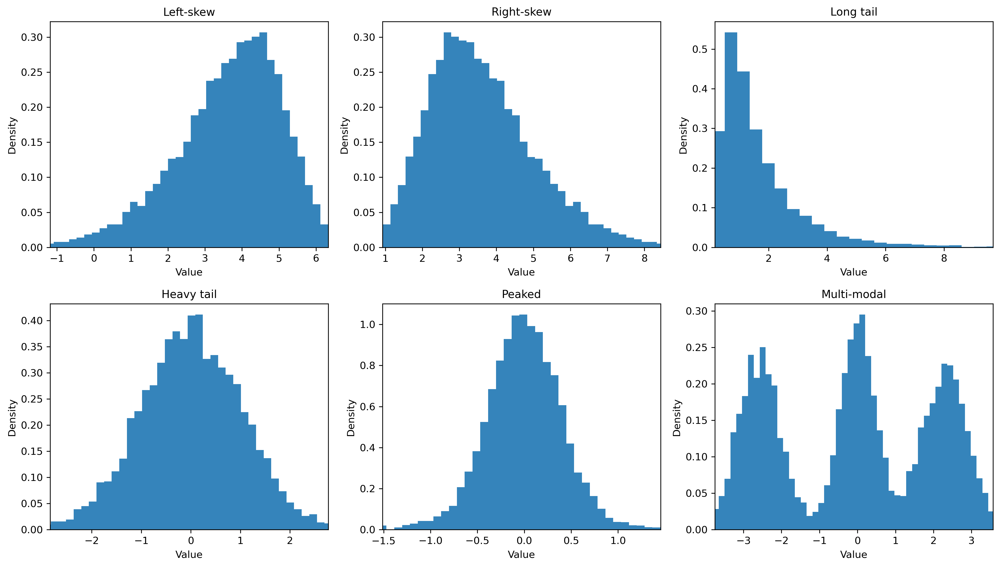
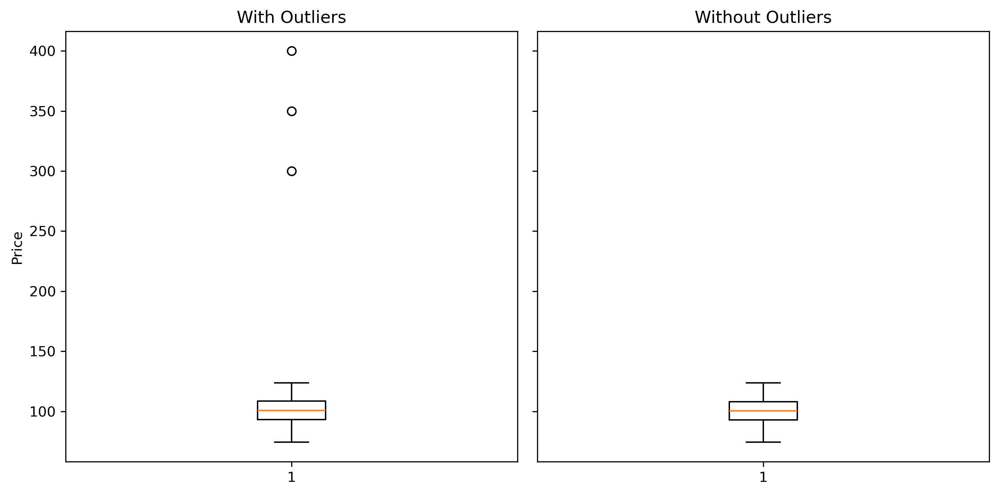
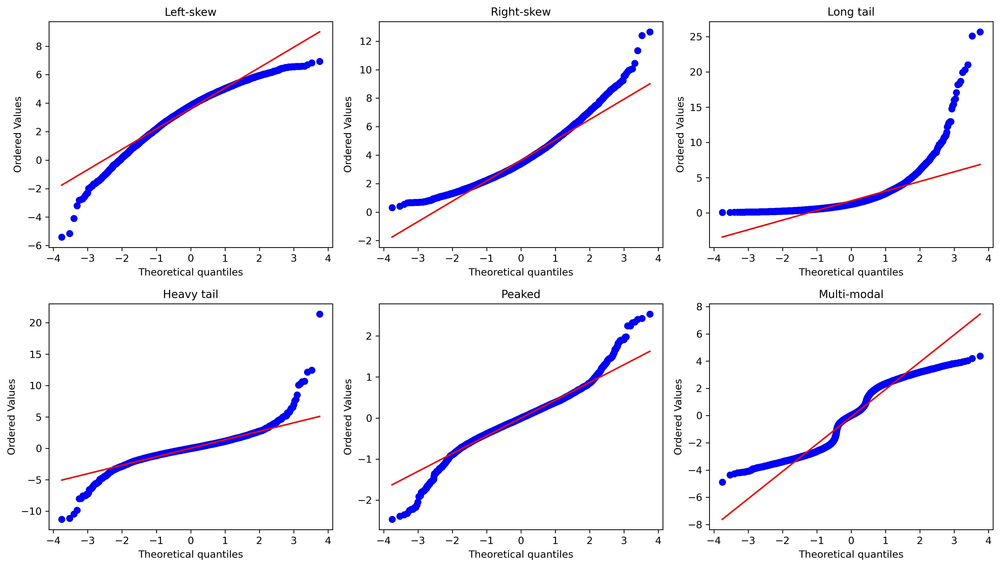
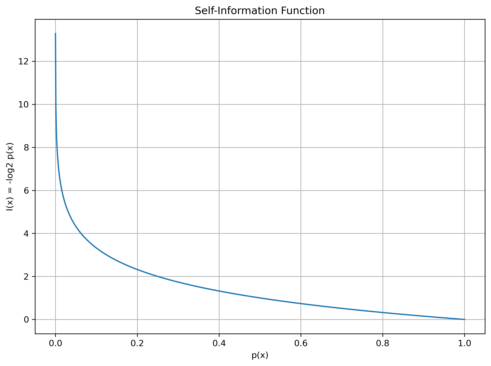

明确问题- 数据收集- 数据清洗 - 特征工程 - 数据集划分 - 建模 - 训练 - 模型评估 - 调参优化 - 上线监控

# 数据清洗 / 预处理
### 1. 查找缺失值
- 按表查询
    ```python
    df.info() # 表概览
    df.isna().any().any() # 查询全表是否有缺失值：BOOL
    np.where(df.isna()) # 精确定位缺失值坐标（适用于极少缺失值）
    df.isna().corr() # 返回pearson系数表，查询特征之间缺失情况的相关性
    ```
- 按列查询
    ```python
    df.isna().any() # 每列是否有缺失值
    df.loc[:, df.isna().any()]# 筛选有缺失的列
    df.isna().sum() # 每列缺失值个数，检查特征是否脏
    df.isna().mean() # 每列缺失比例
    ```
- 按行查询
    ```python
    df.isna().any(axis=1) # 每行是否有缺失
    df[df.isna().any(axis=1)] # 筛选出有缺失的行
    df.isna().sum(axis=1) # 每行缺失值个数，检查样本是否脏
    df.isna().mean(axis=1) # 每行缺失比例
    ```

- 检查特殊占位符
    ```python
    df.isin([0, "Unknown", ""]).any().any() # 查全表有无占位符
    df.isin([0, "Unknown", ""]).any() # 查那些列有占位符
    df.isin([0, "Unknown", ""]).any(axis=1) # 查哪些行有占位符
    df[df.isin([0, "Unknown", ""]).any(axis=1)] # 筛选有占位符的行
    df.loc[:, df.isin([0, "Unknown", ""]).any()] # 筛选有占位符的列
    df.isin([0, "Unknown", ""]) # 返回同形状布尔分布表
    ``` 
- 时间序列查询缺失值
    ```python
    df[df['price'].isna()] # 返回缺失price特征的整行，可以看到日期是否连续
    df['price'].isna().astype(int) # 返回price特征每行是否缺失并用1/0标记 （需要日期索引）
    df.loc[:, ['date', 'price']].assign(miss=df['price'].isna().astype(int)) # 同上，但索引不为日期，因此手动拉日期来看
    df['price'].isna().resample('M').sum() # 按月分组，查询每月price缺失数（必须日期索引）
    ```
- 其他技巧
    ```python
    import numpy as np
    import pandas as pd
    df.shape # 看数据集的形状
    df.shape[0] # 看有多少行（二维数据样本数）
    df.shape[1] # 看有多少列（二维数据特征数）
    np.unique(df) # 看表里有多少非重复值
    len(np.unique(df)) # 返回非重复值的数量
    ```

### 2. 缺失值处理

- **删除**
    - 缺失比例小，且随机的情况下可用
    - 容易破坏时间序列结构
    ```python
    df.dropna() # 删除所有含缺失值的行
    df.dropna(axis=1) # 删除所有含缺失值的列
    ```
- **默认值填充**
    - 类别特征可根据业务意义用Unknown表示
    - 时间序列缺失，数值缺失通常不填
    ```python
    df['gender'] = df['gender'].fillna('Male')

    df = df.fillna({
    'income': 0,
    'gender': 'Unknown'
    }) # 用dict一次填多列
    ``` 
- **统计值填补**
    ```python
    df['income'] = df['income'].fillna(df['income'].mean()) # 均值填补
    df['income'] = df['income'].fillna(df['income'].median()) # 中位数填补
    df['gender'] = df['gender'].fillna(df['gender'].mode()[0]) # 众数填补，0表示取第一个众数

    df = df.fillna({
        'income': df['income'].median(),
        'age': df['age'].median(),
        'gender': df['gender'].mode()[0]
    }) # 一次填多列
    ```
    - 众数：适用类别型特征，类别数量少，主流类别占比高
    - 中位数：适用数值型特征，有偏态。会导致压缩方差
    - 均值：适用数值型特征，对称分布，异常值少。会导致压缩方差
- **缺失指示变量**
    - 步骤：
        1) 先创建指示变量作为新特征，表示原特征是否缺失(BOOL)。
        2) 填补原特征
        3) 被填补的**原特征**和**指示变量**作为两个特征参与建模
    - 适用于缺失值非随机情况，例如受访者不披露资产
    - 缺失完全随机时会导致噪声
    - 类别列经常用Unknown作类别而不用指示变量
    ```python
    df['income_missing'] = df['income'].isna().astype(int) #创建指示变量
    df['income'] = df['income'].fillna(df['income'].median()) 
    ```
- **分组填补**
    ```python
    df['salary'] = (
        df.groupby('industry')['salary'] #把数据按行业分组，在每个组里都取salary
        .transform(lambda x: x.fillna(x.median())) #.transform()表示对前面每一组做变换，但返回长度必须一致
    ) # lambda表示匿名函数，形参x接收到的信息为每一组的salary
    ```
    - 群体差异明显的时候适用
    - 分组后样本少，分组变量本身也缺失时不适用

- **插值法**
    ```python
    df['price'].interpolate() # 线性插值，适用缺失值两边最近的样本
    df['price'].ffill() # 前向填充，用上一个值来填充
    df['price'].bfill() # 后向填充
    df['price'].interpolate(method='time') # 时间间隔插值。要求index为有序时间
    ```
- **多项式插值**
    - 原理是必有一个n-1阶的多项式曲线可穿过平面上n个样本点
    - 阶数为1就等于双样本线性插值
    - 容易出现Runge现象，阶数高时，为了穿过所有点，曲线会剧烈震荡
    - 单个点的变动容易影响整条曲线
    ```python
    df['price'].interpolate(method='polynomial', order=2) # order为阶数
    ```
- **spline插值**

    - 步骤:
        1) 用若干个多项式来拼接成平滑曲线
        2) 设定好阶数n后，算法会使用最近的n+1个点，划分为n段，每段都做一个n阶多项式曲线
        3) n条曲线在相接处值相等，1阶，2阶～n-1阶导数连续
        4) 联立方程组后求出n个多项式
    - 适用时间序列数据，变化连续平滑，缺失点零星，非线性，关注趋势。
    - 不使用大断连续缺失，结构性断点（政策，危机），跳跃变量，尾部风险，无序数据。
    - **为什么工业界常用cubic spline**
        - cubic spline 就是三次样条插值（三阶）
        - 因为正好函数值，一阶导，二阶导连续
        - 一阶导表示函数本身没有拐角，二阶导连续表示曲线弯曲自然
        - 更高阶更光滑，但对噪声过于敏感，数值不稳定
        - 三次多项式局部性强，不容易被远处的点影响
    ```python
    # pandas写法
    df['price'].interpolate(method='spline', order=3)  
    ```
    ```python
    # scipy底层写法
    from scipy.interpolate import CubicSpline
    x = df.index.astype('int64') # 设定索引，必须为数值
    y = df['price'] # 设定要填补的特征

    cs = CubicSpline(x[~y.isna()], y.dropna()) # cs = CubicSpline(x_known, y_known)； ~y.isna()表示与y.isna()相反
    df.loc[y.isna(), 'price'] = cs(x[y.isna()]) # 左边表示填充，右边表示把缺失行的索引输入cs函数里，得出特征y
    ```
- **模型填充**
    - 可采用线性回归，KNN，决策树，随机森林LightBooosts，梯度提升树，深度学习等方法填充
    - 工业界常用随机森林 + 缺失指示变量
    - 适用于变量强相关，特征多且非线性

    ```python
    # 示例随机森林模型填补缺失值代码
    # 代码中存在数据泄露，填补时使用的训练数据在未来的测试集中会用到
    # 实际上用于填补缺失值的训练样本，应当与后期建模划分的训练集一致
    from sklearn.ensemble import RandomForestRegressor

    target = 'price'
    features = ['volume', 'market_return', 'volatility', 'industry_code']

    train_df = df[df[target].notna()]
    pred_df  = df[df[target].isna()]

    rf = RandomForestRegressor(
        n_estimators=300,
        max_depth=10,
        random_state=42
    )

    rf.fit(train_df[features], train_df[target])

    df.loc[df[target].isna(), target] = rf.predict(pred_df[features])
    ```
### 3. 查找异常值
- **描述性统计**
    ```python
    df.describe()
    ```
    - 检查min/max是否离谱
    - std是否过大
    - mean与median是否差距大
- **分布可视化**
    - 直方图
        ```python
        import numpy as np
        np.log1p(df['price']).hist(bins=50)
        ```
        - 看整体形状是否正态，是否左偏右偏
        - 是否长尾或厚尾，异常值往往在尾部。
        长尾是往往是右边拉的很远，均值$>>$中位数
        厚尾说明极端值出现频率高
          > 累积（乘法）效应，资源不均，极端事件导致
          > 会让均值和方差不稳定，梯度不稳定，模型更关注极端样本
        - 是否尖峰
            > 占位符，下限截断（域值以下记0），业务规则（免费交易）
            > 分布不连续，模型学到假信号，均值和方差失真
        - 是否多峰
            > 混了不同群体或机制（混合不同分布）
            > 模型无法学到同一规律，均值无代表性
            
        &nbsp;&nbsp;&nbsp;&nbsp;&nbsp;&nbsp;&nbsp;&nbsp;&nbsp;
   
    - 对数坐标 Log Scale 直方图
        ```python
        import numpy as np
        np.log1p(df['price']).hist(bins=50)
        ```
        - 金融的金额，成交量等容易长尾，有一些大值，因此需要$log(1+x)$变换。
        - 如果$log$后更正态，说明原数据长尾
        - 如果$log$后有极端孤点，说明有异常极端数据

    - 箱线图
        ```python
        import matplotlib.pyplot as plt
        df.boxplot(column='price')
        plt.show()
        ```
        - $Q1$：25% 分位数  
         $Q3$：75% 分位数  
         $IQR = Q3 - Q1$

        - 异常值定义：
        $$
        x < Q1 - 1.5 \times IQR \quad \text{或} \quad x > Q3 + 1.5 \times IQR
        $$

        &nbsp;&nbsp;&nbsp;&nbsp;&nbsp;&nbsp;&nbsp;&nbsp;&nbsp;
        - 箱子中间的线: 中位数
        箱子上下边: $Q1 / Q3$
        上下“须”：$1.5\times IQR$ 的范围
        箱外点： 异常值
        - 适合中等样本量，单变量快速扫描，不依赖正态假设
        不适合极端长尾数据（会标一堆点）
 
        - 箱线异常值手动筛选
            ```python
            Q1 = df['price'].quantile(0.25)
            Q3 = df['price'].quantile(0.75)
            IQR = Q3 - Q1

            lower = Q1 - 1.5 * IQR
            upper = Q3 + 1.5 * IQR

            outliers = df[(df['price'] < lower) | (df['price'] > upper)]
            ```

    - $Q-Q$ 图
        - QQ 图用来比较数据分布和某个理论分布（通常是正态分布）是否一致
        - 横轴：理论分布的分位数
        纵轴：样本数据的分位数
        - 每个百分位都差不多 → 分布相似
        尾部差很多 → 尾部行为不一样
        - 
        &nbsp;&nbsp;&nbsp;&nbsp;&nbsp;&nbsp;&nbsp;&nbsp;&nbsp;
        <br>
- **Z-score法**
    - Z-score（标准分数，standard score）用来衡量一个数据点离均值有多远，单位是“标准差”。

    \[
    z = \frac{x - \mu}{\sigma}
    \]

    - \(x\)：样本值  
    \(\mu\)：样本均值（mean）  
     \(\sigma\)：样本标准差（standard deviation）
    - 当 \(|z| > 2\) 时，认为是可能异常值  
     当 \(|z| > 3\) 时，认为是强异常值 

    - 正态分布中约 99.7% 的数据落在 $±3σ$ 内, 超过 $3σ$ 的点出现概率极小
    - Z-score适用于正态分布；不适合偏态、长尾、厚尾或多峰
    对异常值本身敏感，均值和标准差容易被拉偏；小样本情况下不稳定 
- **MAD绝对中位差方法**
    - MAD（Median Absolute Deviation）是一种对异常值稳健的离散程度度量方法。
    与标准差不同，MAD 使用中位数而非均值作为中心，因此不易受极端值影响。
<br>
        1) 需要计算每个样本到中位数的绝对偏差  
        \[
        |x_i - \text{median}|
        \]
        2) 对绝对偏差取中位数  
        \[
        \text{MAD} = \text{median}(|x_i - \text{median}|)
        \]
        - MAD作为绝对偏差中位数，可以表示一个“典型的数据点”离中位数有多远

    - MAD Robust Z-Score
        在正态分布情况下，$MAD = \Phi^{-1}(0.75) = 0.6745 \sigma$
        为与标准差尺度 ($3\sigma$ 标准) 对齐，通常对 MAD 进行缩放：

        \[
        z_{robust} = \frac{x - \text{median}}{1.4826 \times \text{MAD}}
        \]
        - 其中 1.4826 是正态分布下的校正系数，使 MAD 与标准差具有可比性。


        - 常用阈值：\(|z_{robust}| > 3\) 或 \(> 3.5\)

    - MAD不依赖正态分布假设，适用于长尾厚尾，异常值较多的现实数据，如金融价格、交易金额、用户行为数据。
    - 特点是使用中位数作为中心，稳健性强，判断标准不易被异常值“污染” 

### 4. 异常值处理
- **删除**
对明显错误数据直接删除
- **截尾 Winsorization**
将超出百分位 (两端 1%) 的数值替换为百分位处的边界值，好处是会保留样本
    ```python
        df["income"] = df["income"].clip(
            lower=df["income"].quantile(0.01),
            upper=df["income"].quantile(0.99)
        )
    ```
- **新增标记变量**
    将极端值标记出来，以“是否极端”作为新特征列
    ```python
    df["is_high_income"] = (df["income"] > threshold).astype(int)
    ```
- **非线性变换**
    > 非线性变换会压缩异常值对模型的影响。目标减少极端值的杠杆效应，改善偏态 / 长尾，提升模型稳定性


    - **对数变换**
        - 适用于右偏、长尾数据，如金额/收入/交易量/计数，异常值主要在大值端
        必须为非负数据
        ```python
        import numpy as np
        df["x_log"] = np.log(df["x"])
        df["x_log1p"] = np.log1p(df["x"]) # 防止含0
        ```
    - **平方根变换**
        - 适用于中轻度右偏、长尾数据，泊松型数据，比 $log$ 温和
        必须为非负数据
        ```python
        import numpy as np
        df['x_sqrt'] = np.sqrt(df['x'])
        df['x_sqrt'] = np.sqrt(df['x'] + 1e-6) #防止含0
        ```
    - **Box-Cox 变换**
        - 是参数化的幂变换，对大值进行压缩，不同 \(\lambda\) 对异常值的压缩强度不同。$\lambda = 0 $ 时等同于 $log$
        - 原理是通过选择合适的参数 \(\lambda\)，使数据更接近正态分布
            > 变换后的数据应该满足：$x^{(\lambda)} \sim \mathcal{N}(\mu, \sigma^2)$, 因此可通过极大似然估计计MLE计算变换后数据在正态分布假设下的对数似然值，并得出参数$\lambda$ $$
                \ell(\lambda)
                =
                -\frac{n}{2}\log(\hat{\sigma}^2_\lambda)
                +
                (\lambda - 1)\sum_{i=1}^{n} \log x_i
                $$
        - 变换后变量的解释性会降低
        - 必须为正数，非负非0，变换式为：
            $$
            x^{(\lambda)} =
            \begin{cases}
            \dfrac{x^\lambda - 1}{\lambda}, & \lambda \neq 0 \\
            \log(x), & \lambda = 0
            \end{cases}
            $$
        - scipy 代码
            ```python
            from scipy.stats import boxcox

            amount_bc, lambda_hat = boxcox(df['amount']) # Box-Cox 变换

            df['amount_boxcox'] = amount_bc # 保存结果
            print("Optimal lambda:", lambda_hat) # 查看参数
            ```
        - sklearn 代码
            ```python
            from sklearn.preprocessing import PowerTransformer

            pt = PowerTransformer(method='box-cox', standardize=True) # 创建变换器对象，stanardize代表变化后是否将尺度标准化

            df['amount_boxcox'] = pt.fit_transform(df[['amount']]) # 拟合变换并存入结果
            ```
    - **Yeo – Johnson 变换**
        - 同样是幂变换，改变偏态、长尾和异常值影响
        - 允许数据是负数或0
        - 当 \(x \ge 0\) 时：
        \[
        x^{(\lambda)} =
        \begin{cases}
        \frac{(x+1)^\lambda - 1}{\lambda}, & \lambda \neq 0 \\
        \log(x+1), & \lambda = 0
        \end{cases}
        \]
        当 \(x < 0\) 时：
        \[
        x^{(\lambda)} =
        \begin{cases}
        -\frac{(1-x)^{2-\lambda} - 1}{2-\lambda}, & \lambda \neq 2 \\
        -\log(1-x), & \lambda = 2
        \end{cases}
        \]
            > $x+1$ 的是为了保证 $x$ 可以取0，且在$\lambda = 0 $ 时两段函数可以平滑过渡。$(x + 1) ^ \lambda$ 后面 减 1 是为了锚定 $\lambda = 1$ 的情况下等同于不变换数据。
        - 适用于偏态分布，长尾问题，异常值对线性模型的杠杆效应，违反正态性假设等情况
        - scipy 代码
            ```python

            from scipy.stats import yeojohnson
            amount_yj, lambda_hat = yeojohnson(df['amount']) 

            df['amount_yeojohnson'] = amount_yj
            print("Optimal lambda:", lambda_hat)
            ```
        - sklearn 代码
            ```python
            from sklearn.preprocessing import PowerTransformer

            pt = PowerTransformer(method="yeo-johnson", standardize=False)
            X_train_yj = pt.fit_transform(X_train[["x"]])
            X_test_yj  = pt.transform(X_test[["x"]])
            ```


### 5. 标准化
- 标准化定义
    - 标准化是将特征变换为 **均值为 0、标准差为 1** 的过程，最常用的是 **Z-score 标准化**：
        > 标准化是线性转化，不会改变原分布。

    \[
    x_{\text{std}} = \frac{x - \mu}{\sigma}
    \]

    $\mu$：样本均值（mean）
    $\sigma$：样本标准差（standard deviation）

- 整个特征集的标准化代码
    ```python
    # 防止数据泄露，训练集和测试集必须分开标准化。
    # 训练集用fit，测试集只能用transform。
    from sklearn.preprocessing import StandardScaler

    scaler = StandardScaler() #创建标准化对象

    # X_train全为数值列
    X_train_std = scaler.fit_transform(X_train) 
    X_test_std  = scaler.transform(X_test)
    ```
- 对指定列的标准化代码
    ```python
    from sklearn.preprocessing import StandardScaler

    cols_to_scale = ["age", "income"] # 指定需要标准化的列
    scaler = StandardScaler() #创建对象
    
    # 下方需就地赋值，因此需要copy(),X_train_std和X_train不可指向同一内存
    X_train_std = X_train.copy()
    X_test_std  = X_test.copy()

    # 用训练后的cols_to_scale列替换复制表里的cols_to_scale列
    X_train_std[cols_to_scale] = scaler.fit_transform(X_train[cols_to_scale])
    X_test_std[cols_to_scale]  = scaler.transform(X_test[cols_to_scale])
    ```


- 标准化作用
    - **消除量纲影响**：避免大尺度特征主导模型
    - **距离可比**：对基于距离/内积的模型至关重要
    - **加速收敛**：提升梯度下降的数值稳定性
        > 梯度下降公式中，特征的量纲问题导致对应的权重梯度：$\frac{\partial L}{\partial w_j} = x_j (\hat{y} - y)$ 的大小不同，从而无法调控统一的学习率  $\eta$
    - **正则化友好**：使 L1/L2 惩罚在不同特征上公平
        > 正则化惩罚权重，小尺度特征的权重天然比大尺度大，惩罚力度太高。
- 适用模型

    | 建模机制 | 模型 | 为什么需要标准化 |
    |---------|----------|------------------|
    | 基于距离 | KNN、K-means、层次聚类 | 距离需要可比，否则会被尺度较大的特征主导 |
    | 基于内积 | SVM、PCA、线性模型 | 内积大小受尺度影响，向量方向被扭曲 |
    | 梯度优化 | Linear、Logistic、神经网络 | 梯度量级不一致，导致收敛变慢或不稳定 |
    | 正则化项| Ridge、Lasso、Elastic Net | L1/L2 惩罚在不同尺度特征上不公平 |
- 为什么树模型不需要标准化数据：
   - 树模型不考虑数值的量纲，没有距离，内积和梯度。影响树模型的只有数值排序和分裂阈值。标准化后分裂得到的左右子集相同，信息增益/Gini/MSE 降幅不变

### 6. 归一化

- 归一化定义
    - 归一化是将特征线性映射到一个固定区间（通常是 $[0, 1]$）的过程，最常用的是 **Min-Max 归一化**：

    \[
    x_{\text{norm}} = \frac{x - x_{\min}}{x_{\max} - x_{\min}}
    \]

    $x_{\max} / x_{min}$：样本最大 / 小值  

    <br>
- 特征集的归一化代码
    ```python
    from sklearn.preprocessing import MinMaxScaler

    scaler = MinMaxScaler() 

    X_train_norm = scaler.fit_transform(X_train)
    X_test_norm  = scaler.transform(X_test)
    ```

- 指定列的归一化代码
    ```python
    from sklearn.preprocessing import MinMaxScaler

    cols_to_scale = ["age", "income"]  
    scaler = MinMaxScaler()

    X_train_norm = X_train.copy()
    X_test_norm  = X_test.copy()

    X_train_norm[cols_to_scale] = scaler.fit_transform(X_train[cols_to_scale])
    X_test_norm[cols_to_scale]  = scaler.transform(X_test[cols_to_scale])
    ```

- 归一化作用
    - **统一数值范围**：将不同量纲的特征压缩到相同区间
    - **避免数值过大**：提升数值稳定性，减少溢出风险
    - **适合有边界的特征**：如比例、概率、像素值等
    - **利于基于距离的模型**：在特征原本具有相同语义尺度时效果较好
        > 归一化不会消除偏态（skewness），只进行线性缩放

- 归一化适用模型
    > 实际上基本不用

    | 建模机制 | 模型 | 为什么需要归一化 |
    |---------|------|------------------|
    | 基于距离 | KNN、K-means | 距离受特征数值范围直接影响 |
    | 神经网络+有界激活函数 | NN（含 Sigmoid / Tanh） | 输入落在激活函数敏感区间 |
    | 图像数据 | CNN | 像素值天然有固定上下界 |
    | 特征有自然边界 | 比例、概率 | 保留原始区间语义 |

- 归一化的局限性
    - **对异常值极其敏感**：极端值会压缩其他样本
    - **分布形态不变**：偏态、多峰问题仍然存在
    - **跨数据集不稳定**：当测试集超出训练集范围时，可能出现值 > 1 或 < 0
- 为什么树模型不需要归一化：
    - 树模型只依赖特征排序与分裂阈值
    - 归一化是单调线性变换，不改变样本顺序
    - 左右子集划分结果不变，信息增益 / Gini / MSE 降幅不变


# 决策树
### 1. 信息论

- **信息量**
    - 设某事件发生的概率为 $p(x)$，其信息量定义为：
        $$
        I(x) = - \log_2 p(x)
        $$

       

       - 信息本质上是打破原本预期的程度
       - **事件发生的概率越小，所含的信息量越大**
       - 从编码角度出发，概率小的事件需要更多的编码长度来描述。在最优压缩下，描述 $\frac{1}{2}, \frac{1}{4},\frac{1}{8}$ 的等概率事件分别占用1 bit, 2 bit, 3 bit长度的编码
    <br>
- **熵 Entropy**

    - 熵是不确定性的度量。系统的不确定性越大，熵越高
    - 对于离散随机变量 $Y$，有 $k$ 个类别，对应概率分别 为 $p_1, p_2, ..., p_k$, 则信息熵（离散熵）为：

        $$
        H(Y) = - \sum_{i=1}^{k} p_i \log_2 p_i
        $$

        也就是平均信息量：

        $$
        H(Y) = \mathbb{E}[-\log_2 p(Y)]
        $$
    - 连续型随机变量则为微分熵：

        $$
        H(Y) = - \int_{-\infty}^{\infty} f(y) \log f(y)\, dx
        $$
        - 微分熵以 $e$ 为底，因此单位不为bit，而是nat

    - 若有一个类别概率为1，则没有不确定性，熵为0。
    - 多类别下，均匀分布时熵最大，$H_{\max} = \log_2 k$，$k$ 为类别
<br>
- **条件熵**
    - $X$ 为特征，$Y$ 为事件，条件熵 $H(Y|X)$ 表示在已知 $X$ 的情况下，$Y$ 还剩下多少不确定性。
    - 计算方法是每种 $X$ 情况下 $Y$ 的信息熵的加权平均：
    \[
    H(Y \mid X)
    =
    \sum_{x} p(x)\, H(Y \mid X=x)
    \] 其中：\[
    H(Y \mid X=x)
    =
    -\sum_{y} p(y \mid x)\log p(y \mid x)
    \]

- **信息增益**

    - 表示一个特征能减少多少不确定性，也称互信息
    - 公式为为 原熵 - 条件熵：
        \[
        IG(Y, X) = H(Y) - H(Y\mid X)
        \]
        - $X$ 为特征，$Y$ 为变量
        - \(IG\) 越大，说明 \(X\) 对 \(Y\) 的解释能力越强。
        - \(IG=0\) 表示 \(X\) 对 \(Y\) 没提供任何信息（独立）
<br>
- **基尼指数**
    - 衡量一个数据集合中的不纯度（impurity）
    - 衡量方式是通过表示随机抽两个样本，它们属于不同类别的概率：
    $$
    Gini = 1 - \sum_{i=1}^{k} p_i^2
    $$
    - Gini指数为0时，数据集最纯，只有一个类别，均匀分布时Gini指数最大

### 2. ID3 决策树
- 是一种分类算法，核心思想是通过数的分裂让数据更纯，类别更确定，减少不确定性。衡量分裂效果的指标使用信息增益，IG越大划分效果越好。
- ID3 流程：
    1. 计算数据集的熵
    2. 计算依据每个特征分裂的条件熵
    3. 得出每个特征的信息增益: 熵 - 条件熵。 并取最大的IG
    4. 重复上述步骤构建子树分裂，直到无特征可分/熵为0/样本为0
- ID3 的局限性：
- 类别多的特征，信息增益总是大的，因为这样样本分的更纯
- 只能处理离散特征
- 容易过拟合，无剪枝机制，一直分到数据纯净
    > ID3 过拟合原因
        1. 结构层面分的过深，一直到样本纯净为止
        2. 信息增益机制是贪心算法，导致局部最优
        3. 贪心算法本身就不评估泛化能力
        4. 倾向于以类别多的特征来分类，极端情况下第一步以User_ID来分裂，熵直接为0，属于完全记忆数据而非学习

### 3. C4.5 决策树
- 核心思想与ID3 决策树相同，但指标使用信息增益率，解决了分裂偏好类别多的特征的问题
- C4.5 流程：
    1. 计算数据集的熵
    2. 计算依据每个特征分裂的条件熵
    3. 得出每个特征的信息增益
    4. 计算分裂信息
    5. 计算信息增益率并以最大值分裂
    6. 重复上述步骤构建子树分裂，直到无特征可分/熵为0/样本为0
    7. 剪枝
- 信息增益率
    - 用当前的特征的信息增益除以特征熵：
    \[
    GainRatio(D,A)=\frac{IG(D,A)}{H_A(D)}
    \]
        - D为数据集
        - A为划分数据集的特征
        - $H_A(D)$为特征的分裂信息，也叫特征熵。表示在数据集D中，特征A的经验熵
            > 也就是信息论中的随机变量的熵 $H(X)$。由于 A 的类别分布是在数据集D上的经验分布而非真实分布，因此不用 $H(A)$表示

- C4.5局限性
    - 贪心算法局部最优
    - 计算复杂
    - 树可能较深，噪声敏感

### 4. CART决策树
- CART通过不断二叉划分，使得子节点更纯或更稳定。
- CART 可以解决分类问题，也可以解决回归问题
- CART分类使用的分裂指标为基尼指数，选择基尼指数最小的
- CART回归使用的分裂指标为MSE

- CART流程：
    1. 遍历所有特征，穷举所有特征的所有二分裂情况
    2. 计算所有分裂的基尼指数或MSE
    3. 选择最优分裂节点
    4. 若满足停止条件则停止，否则递归构建子树
    5. 代价复杂度剪枝
- **CART 分类树：**
    - 对离散特征：
        1. 枚举所有二分裂的可能，含有 $k$ 种类别的特征可以产生 $2^{k-1}-1$ 种分裂可能
        2. 计算每种分裂后的加权节点基尼指数：
            \[
                Gini_{split}(X_j, t)
                =
                \frac{|D_L|}{|D|} Gini(D_L)
                +
                \frac{|D_R|}{|D|} Gini(D_R)
            \]
            - $\frac{|D_L|}{|D|}, \frac{|D_R|}{|D|}$ 表示分裂后左右的样本数占比
            - $Gini(D_L), Gini(D_R)$ 表示分裂后左右数据的基尼指数
            - 特征只用来分裂，不参与基尼指数计算，基尼指数的加权和计算都是对节点的样本数据计算的
        3. 取基尼指数最小的作为分裂点
    - 对连续特征：
        1. 将数值升序排序
        2. 在两两相邻数值间求中点作为分裂阈值，相邻数值相同处不产生分裂阈值
        3. 计算每种分裂后的加权节点基尼指数
        4. 取基尼指数最小的作为分裂点

- **CART 回归树：**
    - 回归树是用来预测连续数值变量的，本质是把特征空间分成多个区域，每个区域用一个常数来预测。
        1. 对所有离散特征或者连续特征枚举所有分裂点的可能
        2. 计算每种分裂后的节点损失：
            \[
                Loss_{split}(X_j, t)
                = Loss(D_L)
                + Loss(D_R)
            \]
            - $Loss(D_L), Loss(D_R)$ 表示分裂后左右节点的回归损失
            - 左右节点的回归损失常用SSE衡量：
                \[
                    SSE(D)=\sum_{i\in D}\left(y_i-\bar{y}_D\right)^2
                \]
            - 特征只用来分裂，不参与损失函数计算，损失的加权和计算都是对节点的样本数据计算的
        3. 取SSE最小的作为分裂点
    - 预测输出（叶子节点）：
        - 回归树在叶子节点输出该节点目标值均值：
            \[
                \hat{y}(x)=\bar{y}_{D_{\text{leaf}}}
            \]
            > CART 回归树计算分裂的损失时一般采用SSE，不需要对左右样本量加权。因为SSE是误差的总和，已经涵盖了样本数信息。如果使用MSE评估分裂结果，则需要加权。
### 5. 剪枝 Pruning
- 核心目的是减少过拟合，提升泛化能力。
- **预剪枝 / 早停**
    - 让树在生长过程中就停止。每个节点划分前评估是否能提升决策树的性能。
    - 常用方法：
        -   最大深度（max_depth）
        -   最小样本数（min_samples_split）
        -   最小叶节点样本数（min_samples_leaf）
        -   最小信息增益（min_gain）
    - 示例代码
        ```python
        from sklearn.tree import DecisionTreeClassifier
        tree = DecisionTreeClassifier(
            max_depth=5,
            min_samples_split=30,
            min_samples_leaf=10,
            min_impurity_decrease=1e-4,
            max_leaf_nodes=50,
            random_state=42
        )
        tree.fit(X_train, y_train)
        ```

- **后剪枝**
    - 生成完整决策树后从底往上检查每个子树。如果保留子树的误差比不保留的误差大，则不保留。

- **悲观误差剪枝**
    - 悲观误差剪枝是C4.5决策树采用的后剪枝方法。决策树的训练误差为 $\frac{e}{n}$，分类错误数 $/$ 样本数，悲观误差剪枝故意修正将误差放大，评估指标变为$\frac{e+0.5}{n}$, 从而惩罚了样本数较少的可能过拟合的叶节点。
    - 悲观误差剪枝只用训练集评估，通过统计方法用训练误差来估计未来误差。
    - 误差估计的原理：
        1. 叶节点中每个样本的预测结果只有对和错，因此错误数 $e$ 的分布是二项分布 $E \sim Bino(n,p)$。
        2. 采用训练误差 $\hat{p} = \frac{e}{n}$ 得出的是错误率的有偏点估计。因此目标需要改为采用一个置信上界 $e_{up}$ 作为保守的估计值，且真实误差数大概率不会超出这个范围：$P(E \leqslant e_{up}) = 1 - \alpha$
        3. 在样本数足够大(np > 5 且 nq > 5)的情况下，二项分布可近似正态分布 $E \approx N(np,npq)$
        4. 对正态分布标准化:
        $$Z = \frac{E - np}{\sqrt{npq}} \approx N(0,1)$$ 
        5. 正态分布是连续的。二项分布是离散的，失败次数为 $e$ 的点代表区间$[e-0.5,e+0.5]$的面积。因此要做连续性修正，X为对应的正态分布变量，使得：
        $$P(E \leqslant e_{up}) = P(X \leqslant e_{up} + 0.5)$$
        6. 因此C4.5决策树采用的错误率指标 $\frac{e+0.5}{n}$ 是基于二项分布的正态近似与连续性修正，对未来误差率构造的保守估计。

- **代价复杂度剪枝**
    - 代价复杂度剪枝是 CART 决策树采用的后剪枝方法。需要先生成最大树，再通过剪枝得到一系列子树，并用验证集/交叉验证选择最优子树。
    - 评估指标为代价复杂度 $R_\alpha(T)$，本质是带正则项的经验风险
    - 剪枝流程：
        1. 生成最大树
        2. 对所有内部节点计算，按该节点剪枝前后的经验风险和叶节点数
        3. 计算出所有内部节点的惩罚系数临界值，选择 $\alpha_t$ 最小的节点，将其以下的分支删除，使其成为叶节点
        4. 采用 weakest link 策略，在剪枝后的新树上重复步骤2-3，从而得到一系列嵌套子树
        5. 交叉验证找出误差最小的子树
    - CART 评估剪枝决策使用的目标函数为：
    \[
    R_\alpha(T) = R(T) + \alpha |T|
    \]
        - 经验风险 $R(T)$ 在分类树中最常采用错误率（偶尔用基尼指数，交叉熵）回归树中使用SSE。
        - $|T|$ 为叶节点数量，用来度量复杂度并给予惩罚
    - 惩罚系数临界值
        \[
        \alpha_t = \frac{R(t)-R(T_t)}{|T_t|-1}
        \]
        - 分子 \(R(t)-R(T_t)\)：把子树剪成一个叶节点后，经验风险增加了多少
        - 分母 \(|T_t|-1\)：剪枝减少了多少个叶节点
        - 因此 \(\alpha_t\) 表示每减少 1 个叶节点需要付出的误差增加的代价
        - 若设定的 $\alpha$ 小于该临界值，表示惩罚较弱，则保留子树更优


